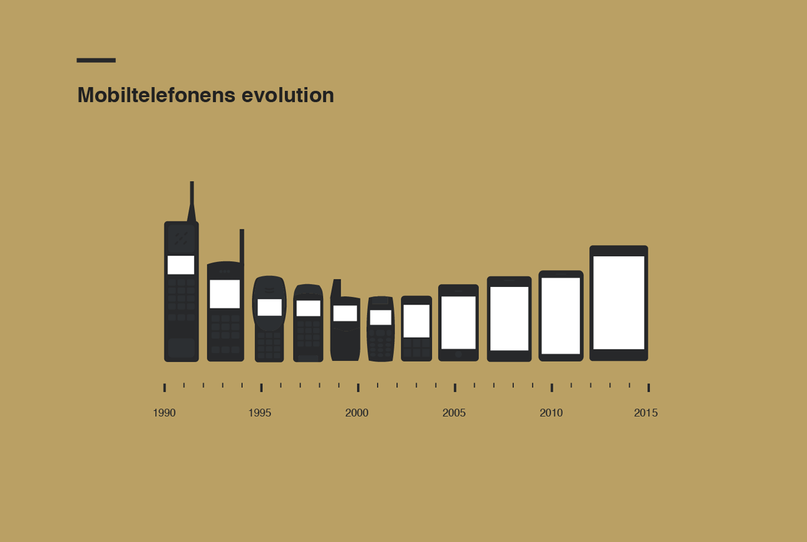
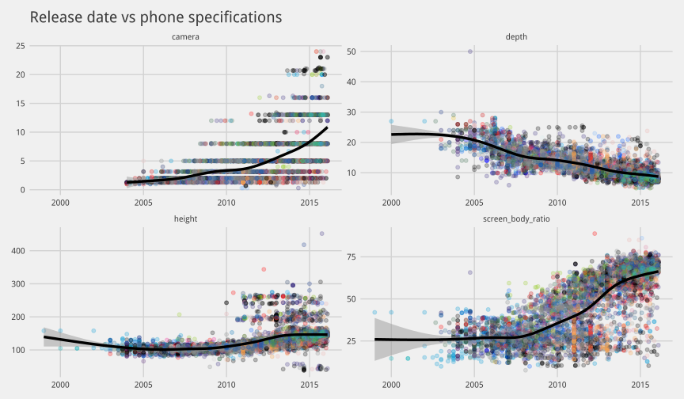

Some time ago I replaced my humble first-generation Moto G with a much larger
Huawei Ascend Mate 7. Suddenly my thumb was learning movements I did not know it
could make just to reach an icon in the opposite corner.

That reminded me of this familiar image:

::: {.column-body}
{fig-align="center" width="82%"}
:::

How true is it? Did phones become smaller and then grow again? This post began
as an excuse to answer that question and see what Highcharter could do with a
few thousand devices.

## A snapshot from 2016

The original analysis collected specifications from GSMArena in March 2016.
The old scraper is not executed here: websites change, selectors break and a
historical post should not make thousands of requests every time it renders.

Fortunately, the final Highcharter widget contained its complete data as JSON.
For this migration I recovered those points into local CSV files. The analysis
therefore represents the same 2016 snapshot as the original article.

```{r}
#| label: setup
#| include: false

source(here::here("blog", "_R", "post_setup.R"))

install_missing_packages(c(
  "dplyr",
  "ggplot2",
  "highcharter",
  "lubridate",
  "purrr",
  "readr",
  "scales",
  "stringr"
))
```

```{r}
#| label: load-phone-packages
#| message: false

library(dplyr)
library(ggplot2)
library(highcharter)
library(lubridate)
library(purrr)
library(readr)
library(stringr)
```

```{r}
#| label: load-recovered-phone-data

phones <- read_csv(
  "data/phones-2016.csv",
  show_col_types = FALSE
) |>
  mutate(
    launch_date = as.Date(launch_date),
    year = year(launch_date)
  )

brands <- read_csv(
  "data/brands-2016.csv",
  show_col_types = FALSE
)

phones <- phones |>
  left_join(
    brands |>
      select(brand, plot_color = color),
    by = "brand"
  )

phones |>
  select(launch_date, brand, model, height_mm) |>
  slice_head(n = 8)
```

The recovered data contain `r scales::comma(nrow(phones))` models from
`r n_distinct(phones$brand)` brands, announced between
`r min(phones$year, na.rm = TRUE)` and `r max(phones$year, na.rm = TRUE)`.

This is not a market-share dataset. A brand with many regional variants or
catalog entries will appear larger even if it did not sell more devices.

## A lot of phones

Samsung had more than one thousand models in the original brand catalogue.
That count includes variants and says more about the breadth of the catalogue
than about commercial success.

```{r}
#| label: plot-largest-phone-catalogues
#| column: page

brands |>
  slice_max(models, n = 20) |>
  mutate(brand = reorder(brand, models)) |>
  ggplot(aes(models, brand, fill = color)) +
  geom_col(width = 0.72) +
  geom_text(
    aes(label = scales::comma(models)),
    hjust = -0.15,
    size = 3.4
  ) +
  scale_fill_identity() +
  scale_x_continuous(
    labels = scales::comma,
    expand = expansion(mult = c(0, 0.1))
  ) +
  labs(
    title = "Brands with the largest phone catalogues",
    subtitle = "Models listed in the recovered GSMArena snapshot",
    x = "Number of models",
    y = NULL,
    caption = "Historical snapshot collected in March 2016"
  )
```

I know: too many colors. The original used each brand's logo color because a
neutral bar chart felt a little too responsible for an experiment called
*BythMusteR*.

## From small phones to large screens

The original dataset included phones, tablets, watches and a few devices that
stretch the definition of a phone. We therefore focus on plausible handheld
heights between 70 and 180 millimetres. This does not produce a perfect sample,
but it makes the comparison more honest.

```{r}
#| label: prepare-phone-height-analysis

phones_analysis <- phones |>
  filter(
    !is.na(launch_date),
    between(height_mm, 70, 180)
  )

monthly_height <- phones_analysis |>
  mutate(month = floor_date(launch_date, "month")) |>
  summarise(
    median_height = median(height_mm),
    models = n(),
    .by = month
  ) |>
  arrange(month)

height_fit <- loess(
  median_height ~ as.numeric(month),
  data = monthly_height,
  span = 0.28
)

monthly_height <- monthly_height |>
  mutate(fitted_height = predict(height_fit))
```

```{r}
#| label: plot-phone-height-evolution
#| column: page
#| fig-format: png

ggplot(phones_analysis, aes(launch_date, height_mm)) +
  geom_point(
    aes(color = plot_color),
    alpha = 0.16,
    size = 1
  ) +
  geom_line(
    data = monthly_height,
    aes(month, fitted_height),
    inherit.aes = FALSE,
    color = "#17324d",
    linewidth = 1.3
  ) +
  scale_color_identity() +
  scale_x_date(date_breaks = "2 years", date_labels = "%Y") +
  labs(
    title = "Mobile phones became small, then large again",
    subtitle = "Each point is one model; the line smooths monthly median height",
    x = "Announcement date",
    y = "Height (mm)",
    caption = "Historical snapshot collected from GSMArena in 2016"
  )
```

The familiar shape is there. Early mobile phones became progressively smaller.
Around the smartphone transition, screens became the main interface and height
started increasing again.

The original analysis also examined depth, camera resolution and screen-to-body
ratio. The recovered height widget does not contain every one of those fields,
so the original result is preserved below as a historical image rather than
pretending those variables can be reconstructed.

::: {.column-page}
{fig-align="center" width="100%"}
:::

## Explore the phones

The interactive version highlights the iPhone and Galaxy S families while
keeping every other model in the background. The curve is recalculated from the
recovered data rather than copied from the old widget.

```{r}
#| label: prepare-interactive-phone-series

galaxy_models <- c(
  "I9000 Galaxy S",
  "I9100G Galaxy S II",
  "I9300 Galaxy S III",
  "I9500 Galaxy S4",
  "Galaxy S5",
  "Galaxy S6",
  "Galaxy S6 edge",
  "Galaxy S7",
  "Galaxy S7 edge"
)

phones_chart_data <- phones_analysis |>
  mutate(
    family = case_when(
      str_detect(model, "^iPhone") ~ "iPhone",
      model %in% galaxy_models ~ "Galaxy S",
      TRUE ~ "Other phones"
    ),
    x = as.numeric(as.POSIXct(launch_date, tz = "UTC")) * 1000,
    y = height_mm,
    color = if_else(
      family == "Other phones",
      scales::alpha(plot_color, 0.18),
      plot_color
    )
  )

phone_points <- function(data) {
  data |>
    transmute(x, y, name = model, brand, color) |>
    purrr::pmap(function(x, y, name, brand, color) {
      list(x = x, y = y, name = name, brand = brand, color = color)
    }) |>
    unname()
}

other_phone_points <- phones_chart_data |>
  filter(family == "Other phones") |>
  phone_points()

iphone_points <- phones_chart_data |>
  filter(family == "iPhone") |>
  phone_points()

galaxy_points <- phones_chart_data |>
  filter(family == "Galaxy S") |>
  phone_points()

trend_points <- monthly_height |>
  filter(!is.na(fitted_height)) |>
  transmute(
    x = as.numeric(as.POSIXct(month, tz = "UTC")) * 1000,
    y = fitted_height
  ) |>
  highcharter::list_parse()
```

```{r}
#| label: show-interactive-phone-height
#| column: page

phone_chart <- highchart() |>
  hc_chart(type = "scatter", zoomType = "xy") |>
  hc_title(text = "Release date versus phone height") |>
  hc_subtitle(text = "A recovered snapshot of 6,285 models through March 2016") |>
  hc_xAxis(
    type = "datetime",
    title = list(text = "Announcement date")
  ) |>
  hc_yAxis(
    min = 70,
    max = 180,
    title = list(text = "Height (mm)")
  ) |>
  hc_add_series(
    data = other_phone_points,
    name = "Other phones",
    turboThreshold = 0,
    marker = list(symbol = "circle", radius = 2),
    zIndex = 1
  ) |>
  hc_add_series(
    data = galaxy_points,
    name = "Galaxy S",
    turboThreshold = 0,
    color = "#403684",
    marker = list(symbol = "circle", radius = 4),
    dataLabels = list(enabled = TRUE, format = "{point.name}"),
    zIndex = 3
  ) |>
  hc_add_series(
    data = iphone_points,
    name = "iPhone",
    turboThreshold = 0,
    color = "#333333",
    marker = list(symbol = "circle", radius = 4),
    dataLabels = list(enabled = TRUE, format = "{point.name}"),
    zIndex = 3
  ) |>
  hc_add_series(
    data = trend_points,
    name = "Trend",
    type = "spline",
    color = "#17324d",
    lineWidth = 3,
    marker = list(enabled = FALSE),
    enableMouseTracking = FALSE,
    zIndex = 2
  ) |>
  hc_tooltip(
    useHTML = TRUE,
    backgroundColor = "rgb(244, 246, 248)",
    borderWidth = 0,
    pointFormat = paste0(
      '<div style="padding:8px;background:#f4f6f8;color:#17324d;opacity:1">',
      '<b>{point.name}</b><br>{point.brand}<br>{point.y:.1f} mm',
      '</div>'
    )
  ) |>
  hc_credits(enabled = FALSE) |>
  hc_size(height = 720)

phone_chart
```

The cartoon exaggerates the story, but it gets the direction surprisingly
right. Miniaturization dominated one era; the screen transformed what a phone
was, and the device grew around it.

### Sources and recovery notes

- Device specifications were originally collected from [GSMArena](https://www.gsmarena.com/) in March 2016.
- The local CSV files were recovered from the JSON embedded in the original Highcharter widgets.
- [`source/extract_highchart_data.R`](source/extract_highchart_data.R) documents the recovery process; it reads only the archived local HTML files and performs no web scraping.
