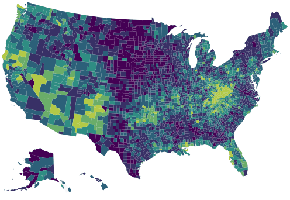

```{r setup, include=FALSE}
source(here::here("blog", "_R", "post_setup.R"))

install_missing_packages(c(
  "jsonlite", "dplyr", "tidyr", "purrr", "highcharter"
))
```

A while ago I saw an R reproduction of a
[New York Times visualization](http://www.nytimes.com/interactive/2016/01/07/us/drug-overdose-deaths-in-the-us.html?_r=0)
about drug overdose deaths in the United States.
The result we hope is like this:



I really like small multiples and this is a good example of usage. However if the 
multiples means a lot mini plots maybe you can try add animation. 

Let's start using the [script](https://gist.github.com/hrbrmstr/a61991ebd8f4f49ce739) made by Bob:

```{r load-drug-death-data}
library(jsonlite)
library(dplyr)
library(tidyr)
library(highcharter)

data("uscountygeojson")
data("unemployment")

data <- fromJSON("data/drug-deaths.json") %>% 
  as_tibble() %>% 
  pivot_longer(-fips, names_to = "year", values_to = "value") %>% 
  mutate(year = sub("^y", "", year),
         value = ifelse(is.na(value), 0, value))

data
```

Now we'll prepare the data as the [motion plugin](http://www.highcharts.com/plugin-registry/single/40/Motion) 
require the data.

```{r build-motion-map}
ds <- data %>%
  arrange(year) %>%
  group_by(fips) %>% 
  summarise(
    sequence = list(value),
    value = first(value),
    .groups = "drop"
  ) %>%
  purrr::pmap(
    function(fips, sequence, value) {
      list(fips = fips, sequence = sequence, value = value)
    }
  )

hc <- highchart(type = "map") %>% 
  hc_add_series(
    data = ds,
    name = "drug deaths per 100,000",
    mapData = uscountygeojson,
    joinBy = "fips",
    borderWidth = 0.01
    ) %>% 
  hc_colorAxis(stops = color_stops()) %>%  
  hc_title(text = "How the Epidemic of Drug Overdose Deaths Ripples") %>% 
  hc_subtitle(text = "Overdose deaths per 100,000") %>% 
  hc_legend(
    layout = "horizontal",
    reversed = TRUE,
    floating = TRUE,
    align = "right"
    ) %>% 
  hc_motion(
    enabled = TRUE,
    axisLabel = "year",
    labels = sort(unique(data$year)),
    series = 0,
    updateInterval = 50,
    magnet = list(
      round = "floor",
      step = 0.1
    )
  ) %>% 
  hc_chart(marginBottom  = 100)
```

And the result:

```{r show-motion-map}
#| column: page
hc
```


