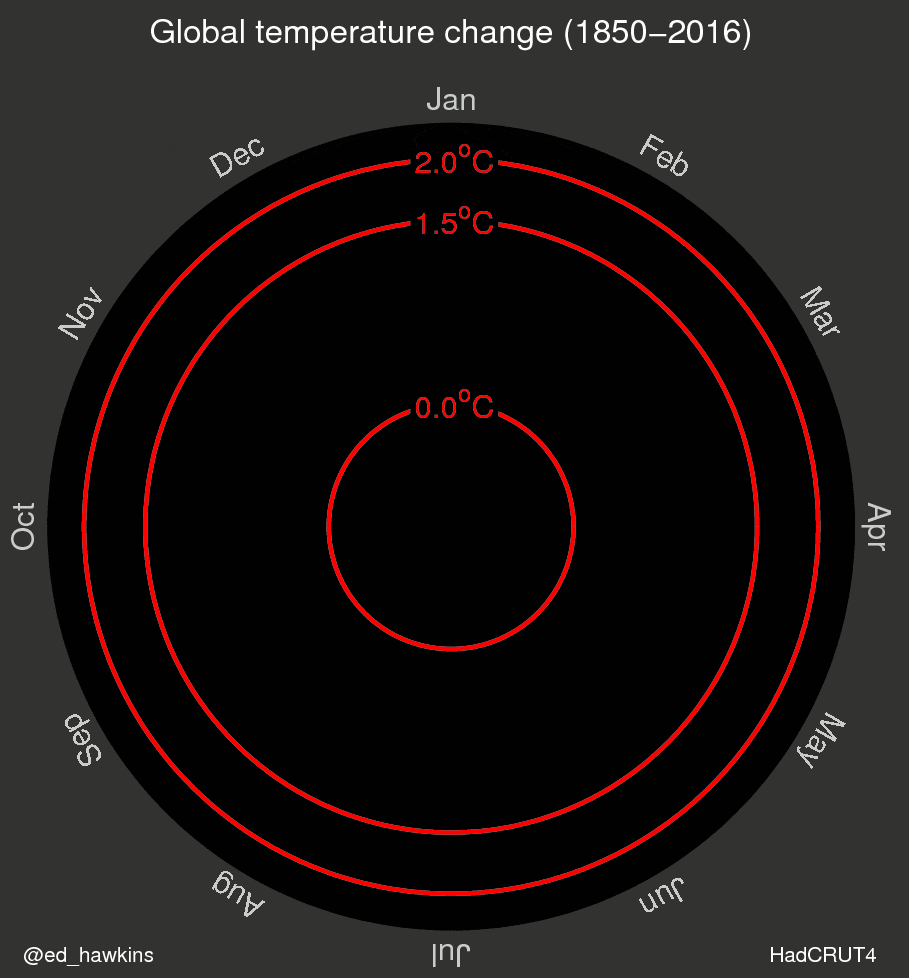

This post asks whether the same data can be shown in different ways to tell the
*wait, is this really happening?* story more clearly.

Some time ago, an animated spiral showing the evolution of global temperature
anomalies began circulating online.

::: {.column-body}
{fig-align="center" width="70%"}
:::

Several sites described it as one of the most convincing climate change
visualizations. That may be a slightly clickbait-ish title, but at least it says
*visualization* :B.

Animation can be compelling, but it does not always make comparison easier. It
asks us to compare what we are seeing now with what we remember seeing a few
seconds ago.

::: {.column-body}
{fig-align="center" width="62%"}
:::

The spiral also accumulates many overlapping lines near the end. The overall
direction is clear, while the pace and uncertainty of the change are harder to
inspect. Let us keep the same data and try a few alternatives.

## Data and packages

The data are a local snapshot of the HadCRUT temperature anomaly dataset shared
by Bob Rudis. Keeping the file beside the post means the historical article no
longer depends on a remote download during every render.

```{r}
#| label: setup
#| include: false

source(here::here("blog", "_R", "post_setup.R"))

install_missing_packages(c(
  "dplyr",
  "highcharter",
  "htmlwidgets",
  "lubridate",
  "purrr",
  "readr",
  "scales",
  "tidyr",
  "viridisLite"
))
```

```{r}
#| label: load-temperature-packages
#| message: false

library(dplyr)
library(highcharter)
library(lubridate)
library(purrr)
library(readr)
library(tidyr)
```

```{r}
#| label: prepare-temperature-data

temperature_data <- read_csv(
  "data/temps.csv",
  show_col_types = FALSE
) |>
  mutate(
    date = ymd(year_mon),
    timestamp = as.numeric(as.POSIXct(date, tz = "UTC")) * 1000,
    year = as.integer(year),
    month = factor(month, levels = month.abb),
    month_color = scales::alpha(
      highcharter::colorize(median, viridisLite::viridis(10, option = "B")),
      0.68
    )
  )

year_colors <- temperature_data |>
  summarise(median = median(median), .by = year) |>
  mutate(
    year_color = scales::alpha(
      highcharter::colorize(median, viridisLite::viridis(10, option = "B")),
      0.72
    )
  ) |>
  select(year, year_color)

temperature_data <- temperature_data |>
  left_join(year_colors, by = "year")

temperature_data |>
  select(date, median, lower, upper, year, month) |>
  slice_head(n = 6)
```

The observations begin in `r min(temperature_data$year)` and end in
`r max(temperature_data$year)`. Each monthly estimate includes a median anomaly
and lower and upper uncertainty bounds.

## The spiral

First, let us reproduce the idea without animation. Every year becomes a polar
line and every position around the circle represents a month.

```{r}
#| label: prepare-year-series

year_series <- temperature_data |>
  arrange(year, date) |>
  group_split(year) |>
  map(function(year_data) {
    list(
      name = as.character(first(year_data$year)),
      data = year_data$median,
      color = first(year_data$year_color)
    )
  })
```

```{r}
#| label: show-static-temperature-spiral
#| column: page

spiral_chart <- highchart() |>
  hc_chart(polar = TRUE, type = "line") |>
  hc_title(text = "Global temperature anomalies by year") |>
  hc_subtitle(text = "Each turn of the spiral represents January to December") |>
  hc_xAxis(
    categories = month.abb,
    tickmarkPlacement = "on",
    lineWidth = 0
  ) |>
  hc_yAxis(
    title = list(text = NULL),
    labels = list(format = "{value} °C")
  ) |>
  hc_plotOptions(
    series = list(
      marker = list(enabled = FALSE),
      lineWidth = 1,
      animation = FALSE
    )
  ) |>
  hc_add_series_list(year_series) |>
  hc_legend(enabled = FALSE) |>
  hc_tooltip(
    headerFormat = "<b>{series.name}</b><br>",
    pointFormat = "{point.category}: {point.y:.2f} °C"
  ) |>
  hc_credits(enabled = FALSE)

spiral_chart
```

Without the animation, the spiral loses much of its rhetorical force. We can
restore that component by creating the series as transparent lines and revealing
them one by one.

```{r}
#| label: prepare-animated-year-series

animated_year_series <- temperature_data |>
  arrange(year, date) |>
  group_split(year) |>
  map(function(year_data) {
    list(
      name = as.character(first(year_data$year)),
      data = year_data$median,
      color = "transparent",
      enableMouseTracking = FALSE,
      custom = list(revealColor = first(year_data$year_color))
    )
  })
```

```{r}
#| code-fold: true
#| label: show-animated-temperature-spiral
#| column: page

animated_spiral <- highchart() |>
  hc_chart(
    polar = TRUE,
    type = "line",
    events = list(
      load = htmlwidgets::JS(
        "function () {
          var chart = this;
          var duration = 16000;
          var interval = duration / chart.series.length;

          chart.series.forEach(function (series, index) {
            window.setTimeout(function () {
              series.update({
                color: series.options.custom.revealColor,
                enableMouseTracking: true
              }, false);
              chart.setTitle({ text: series.name });
              chart.redraw();
            }, 900 + index * interval);
          });
        }"
      )
    )
  ) |>
  hc_title(text = "Animated spiral") |>
  hc_subtitle(text = "Years appear in chronological order") |>
  hc_xAxis(
    categories = month.abb,
    tickmarkPlacement = "on",
    lineWidth = 0
  ) |>
  hc_yAxis(
    title = list(text = NULL),
    labels = list(format = "{value} °C")
  ) |>
  hc_plotOptions(
    series = list(
      marker = list(enabled = FALSE),
      lineWidth = 1,
      animation = FALSE
    )
  ) |>
  hc_add_series_list(animated_year_series) |>
  hc_legend(enabled = FALSE) |>
  hc_tooltip(
    headerFormat = "<b>{series.name}</b><br>",
    pointFormat = "{point.category}: {point.y:.2f} °C"
  ) |>
  hc_credits(enabled = FALSE)

animated_spiral
```

And voilà. The sequence is memorable, although comparing distant years still
depends on memory.

## Seasonal lines

Do we need polar coordinates? We can return to Euclidean space while preserving
the same month-by-month structure.

```{r}
#| label: show-seasonal-temperature-lines
#| column: page

seasonal_chart <- highchart() |>
  hc_chart(type = "spline") |>
  hc_title(text = "Temperature anomalies through the year") |>
  hc_subtitle(text = "One line for every year") |>
  hc_xAxis(categories = month.abb) |>
  hc_yAxis(
    title = list(text = NULL),
    labels = list(format = "{value} °C")
  ) |>
  hc_plotOptions(
    series = list(
      marker = list(enabled = FALSE),
      lineWidth = 1,
      animation = FALSE
    )
  ) |>
  hc_add_series_list(year_series) |>
  hc_legend(enabled = FALSE) |>
  hc_tooltip(
    headerFormat = "<b>{series.name}</b><br>",
    pointFormat = "{point.category}: {point.y:.2f} °C"
  ) |>
  hc_credits(enabled = FALSE)

seasonal_chart
```

Nice colored spaghetti, but not a particularly clear account of what happened
across the full period.

## Heatmap

Another option is to place years along the horizontal axis and months along the
vertical axis.

```{r}
#| label: prepare-temperature-heatmap

temperature_matrix <- temperature_data |>
  select(year, month, median) |>
  pivot_wider(names_from = year, values_from = median) |>
  arrange(month) |>
  select(-month) |>
  as.matrix()

rownames(temperature_matrix) <- month.abb
```

```{r}
#| label: show-temperature-heatmap
#| column: page

heatmap_chart <- hchart(temperature_matrix) |>
  hc_title(text = "Monthly temperature anomalies") |>
  hc_subtitle(text = "Month by year") |>
  hc_colorAxis(
    stops = highcharter::color_stops(
      10,
      viridisLite::viridis(10, option = "B")
    ),
    min = -1,
    max = 1
  ) |>
  hc_yAxis(title = list(text = NULL)) |>
  hc_credits(enabled = FALSE)

heatmap_chart
```

The warmer final years are visible, but color alone makes the magnitude of the
change less direct to quantify.

## A simple time series

Now the simplest chart: place every observation in chronological order.

```{r}
#| label: prepare-temperature-time-series

time_series_data <- temperature_data |>
  transmute(
    x = timestamp,
    y = median,
    name = paste(month, year)
  ) |>
  highcharter::list_parse()
```

```{r}
#| label: show-temperature-time-series
#| column: page

time_series_chart <- highchart() |>
  hc_chart(type = "line", zoomType = "x") |>
  hc_title(text = "Global temperature anomalies") |>
  hc_subtitle(text = "Monthly estimates through time") |>
  hc_xAxis(type = "datetime") |>
  hc_yAxis(
    title = list(text = NULL),
    labels = list(format = "{value} °C")
  ) |>
  hc_add_series(
    data = time_series_data,
    name = "Global temperature",
    color = viridisLite::viridis(10, option = "B")[7],
    lineWidth = 1,
    marker = list(enabled = FALSE),
    turboThreshold = 0
  ) |>
  hc_credits(enabled = FALSE)

time_series_chart
```

Perhaps it is too simple. Or perhaps simplicity is the point.

## Showing uncertainty

Finally, we can add the lower and upper bounds. A column-range chart keeps the
time ordering, exposes uncertainty and uses color to guide attention toward the
most recent warming.

```{r}
#| label: prepare-temperature-ranges

range_data <- temperature_data |>
  transmute(
    x = timestamp,
    low = lower,
    high = upper,
    name = paste(month, year),
    color = month_color
  ) |>
  purrr::pmap(function(x, low, high, name, color) {
    list(x = x, low = low, high = high, name = name, color = color)
  }) |>
  unname()
```

```{r}
#| label: show-temperature-ranges
#| column: page

range_chart <- highchart() |>
  hc_chart(type = "columnrange", zoomType = "x") |>
  hc_title(text = "Global temperature anomalies and uncertainty") |>
  hc_subtitle(text = "Monthly lower and upper estimates") |>
  hc_xAxis(type = "datetime") |>
  hc_yAxis(
    title = list(text = NULL),
    labels = list(format = "{value} °C")
  ) |>
  hc_add_series(
    data = range_data,
    name = "Global temperature",
    turboThreshold = 0
  ) |>
  hc_legend(enabled = FALSE) |>
  hc_tooltip(
    pointFormat = "<b>{point.name}</b><br>{point.low:.2f} to {point.high:.2f} °C"
  ) |>
  hc_credits(enabled = FALSE)

range_chart
```

For me, this version communicates the argument most directly:

- Chronological position makes the past and present easy to compare.
- The interval preserves information hidden by a single line.
- The yellowish final section guides the eye without requiring animation.

Animation is not good or bad by itself. It is a choice about what the reader
should notice, remember and compare.

::: {.column-body}
{fig-align="center" width="58%"}
:::

Do you have another way to represent these data?

### Sources

- [Original HadCRUT data repository](https://github.com/hrbrmstr/hadcrut)
- [The climate spiral discussion on Gizmodo](https://gizmodo.com/one-of-the-most-convincing-climate-change-visualization-1775743779)
- [Highcharter](https://jkunst.com/highcharter/)
