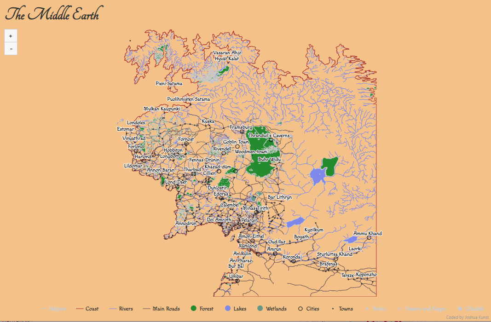

<script>document.body.style.setProperty("--post-accent", "#F4C283")</script>

```{r setup, include=FALSE}
source(here::here("blog", "_R", "post_setup.R"))

install_missing_packages(c(
  "tidyverse", "highcharter", "geojsonio", "rmapshaper", "stringi",
  "sf"
))
```

```{r set-english-locale, echo=FALSE}
invisible(Sys.setlocale("LC_TIME", "English"))
```

This is pure nerdism. There is a project to create a shapfile
from a fictional world, the Middle Earth. The data is in this
https://github.com/jvangeld/ME-GIS repository. The author of the 
r-chart.com web site made a ggplot version of this map which 
you can see in this [link](http://www.r-chart.com/2016/10/map-of-middle-earth-map-above-was.html).

Well, as the highcharter developer I wanted to try to made 
this map using this package and add some styles to give 
the old magic fashioned _Middle Earth_ look. My try to achieve 
this...

::: {.column-body}
{width=100% fig-align="center"}
:::

> Just because we can
> -- <cite>Me.</cite>

... Is summarized as:

- Use the `#F4C283` color as background.
- use the _Tangerine_ font in the title and _Macondo_ in the
legends, tooltips and labels.
- Search _hexadecimal color forest_ to get the the colors for forests.

The packages to made this possible were:

> **Migration note (2026).** The original post used `maptools`, which has since
> been retired from CRAN. This version uses the maintained `sf` package to read
> the same shapefiles while preserving the original visualization workflow.


```{r load-map-packages}
library(tidyverse)
library(sf)
library(highcharter)
library(geojsonio)
library(rmapshaper)
```

Note we used the [`rmapshaper`](https://github.com/ateucher/rmapshaper)
package (wapper for the mapshaper js library)
to simplify the rivers beacuse this file is kind of huge to put
in a htmlwidget.

I made some auxiliar functions to simplify the shapefile and to convert this info in
geojson format using the [geojsonio](https://github.com/ropensci/geojsonio)
package.


```{r prepare-middle-earth-geojson}
fldr <- here::here(
  "blog", "posts", "2016-12-15-interactive-and-styled-middle-earth-map", "data"
)

shp_to_geoj_smpl <- function(file = "Towns.shp", k = 0.5) {
  d <- sf::st_read(file.path(fldr, file), quiet = TRUE)
  d <- ms_simplify(d, keep = k)
  d <- geojson_list(d)
  geojsonio::geojson_write(d, file = str_replace(file.path(fldr, file), "shp$", "geojson"))
  d
}

shp_points_to_geoj <- function(file = "Cities.shp"){
  outp <- sf::st_read(file.path(fldr, file), quiet = TRUE)
  geometry_column <- attr(outp, "sf_column")
  attribute_columns <- setdiff(names(outp), geometry_column)
  names(outp)[match(attribute_columns, names(outp))] <- str_to_title(attribute_columns)
  outp$Name <- stringi::stri_trans_general(outp$Name, "latin-ascii")
  outp <- geojson_json(outp) 
  geojsonio::geojson_write(outp, file = str_replace(file.path(fldr, file), "shp$", "geojson"))
  outp
}

dir(fldr) %>% 
  str_subset(".shp")

cstln <- shp_to_geoj_smpl("Coastline2.shp", .65)

hlprs <- shp_to_geoj_smpl("HelperContours.shp", .65)

rvers <- shp_to_geoj_smpl("Rivers.shp", .01)
frsts <- shp_to_geoj_smpl("Forests.shp", 0.90)

lakes <- shp_to_geoj_smpl("Lakes.shp", 0.1)
wlnds <- shp_to_geoj_smpl("Wetlands02.shp", 0.1)

roads <- shp_to_geoj_smpl("Roads.shp", 1)

ruins <- shp_points_to_geoj("Ruins.shp")
towrs <- shp_points_to_geoj("Towers_and_Keeps.shp")
ctdls <- shp_points_to_geoj("Citadels.shp")
cties <- shp_points_to_geoj("Cities.shp")
towns <- shp_points_to_geoj("Towns.shp")

pointsyles <- list(
  symbol = "circle",
  lineWidth= 1,
  radius= 4,
  fillColor= "transparent",
  lineColor= NULL
)
```

Now, to create the chart we need to add the geographic info one by one setting
the type of info: 

- `mappoint` for cities.
- `mapline` for rivers and the coast.
- And `map` for lakes and forests.


```{r build-middle-earth-map}
hcme <- highchart(type = "map") %>% 
  hc_chart(style = list(fontFamily = "Macondo"), backgroundColor = "#F4C283") %>% 
  hc_title(text = "The Middle Earth", style = list(fontFamily = "Tangerine", fontSize = "40px")) %>% 
  # hc_add_series(data = hlprs, type = "mapline", color = "brown", name = "Helpers", visible = FALSE) %>%
  hc_add_series(data = cstln, type = "mapline", color = "brown", name = "Coast") %>%
  hc_add_series(data = rvers, type = "mapline", color = "#7e88ee", name = "Rivers") %>%
  hc_add_series(data = roads, type = "mapline", color = "#634d53", name = "Main Roads") %>%
  hc_add_series(data = frsts, type = "map", color = "#228B22", name = "Forest") %>%
  hc_add_series(data = lakes, type = "map", color = "#7e88ee", name = "Lakes") %>%
  hc_add_series(data = wlnds, type = "map", color = "#689689", name = "Wetlands") %>%
    hc_add_series(
    data = cties, type = "mappoint", color = "black", name = "Cities",
    dataLabels = list(enabled = TRUE), marker = list(radius = 4, lineColor = "black")
    ) %>%
  hc_add_series(
    data = towns, type = "mappoint", color = "black", name = "Towns",
    dataLabels = list(enabled = TRUE), marker = list(radius = 1, fillColor = "rgba(190,190,190,0.7)")
    ) %>%
  
  hc_add_series(
    data = ruins, type = "mappoint", color = "black", name = "Ruins", visible = FALSE,
    dataLabels = list(enabled = TRUE), marker = list(radius = 2, lineColor = "black")
    ) %>%
  hc_add_series(
    data = towrs, type = "mappoint", color = "black", name = "Towers and Keeps", visible = FALSE,
    dataLabels = list(enabled = TRUE), marker = list(radius = 2, lineColor = "black")
    ) %>%
  hc_add_series(
    data = ctdls , type = "mappoint", color = "black", name = "Citadels", visible = FALSE,
    dataLabels = list(enabled = TRUE), marker = list(radius = 4, lineColor = "black")
    ) %>%

  hc_plotOptions(
    series = list(
      marker = pointsyles,
      dataLabels = list(enabled = FALSE, format = '{point.properties.Name}')
    )
  ) %>% 
  hc_mapNavigation(enabled = TRUE, enableMouseWheelZoom = FALSE) %>% 
  hc_size(height = 800)
```

And you have a super styled chart using only **R** :D!

```{r show-middle-earth-map}
#| column: screen-inset
hcme
```

I did deselect the `Towns` series the chart to zoom smoothly. There 
are some many point that you can see the chart/browser lag when you 
make a zoom.


