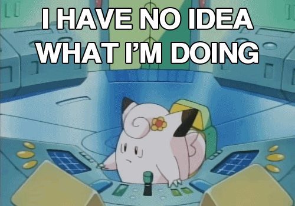
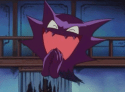

<script>document.body.style.cssText += "--blog-background:#f6d447;--blog-foreground:#172033;--blog-hover:#000000"</script>

```{r setup, include=FALSE}
source("../../_R/post_setup.R")

install_missing_packages(c(
  "tidyverse", "uwot", "highcharter", "htmltools", "FNN",
  "dbscan", "rpart", "knitr", "plotly"
))
```

A long time ago, when I was younger, I knew the original 150 Pokémon.
Then the Pokédex kept growing: new generations, new types, new regions and a
lot more monsters to remember.

In 2016 I downloaded the data and used it as an excuse to make charts and try
a dimensionality-reduction method I had just discovered. The code got old, the
links disappeared, but the question remained fun: **what does the Pokémon
universe look like when similarity becomes a map?**

::: {.column-body}
{width=72% fig-align="center"}
:::

This version keeps the spirit of the
[original post](https://github.com/jbkunst/jbkunst.github.io2/blob/master/_posts/2016-03-08-pokemon-visualize-em-all.md),
but uses the prepared data behind the
[Pokémon Dimensionality Reduction app](https://jbkunst-pokemon-dimensionality-reduction.share.connect.posit.cloud/),
all nine generations, UMAP, and the current site setup. Then it goes one step
further: can we find groups, describe their members, and summarize their
assignments with a small decision tree?

## Data

The prepared dataset joins the maintained PokeAPI tables: battle stats,
morphology, capture and breeding traits, egg groups, species metadata, types,
generation, and current sprite URLs. Keeping that preparation outside the post
makes this article reproducible without downloading and joining many remote
tables during every render.

```{r load-pokemon-data}
library(tidyverse)
library(highcharter)

pokemon_bundle <- readRDS("data/pokemon-data.rds")

pokemon <- pokemon_bundle$data |>
  filter(generation_id %in% 1:9) |>
  mutate(
    generation_label = factor(
      paste("Generation", generation_id),
      levels = paste("Generation", 1:9)
    ),
    pokemon_label = pokemon |>
      str_replace_all("-", " ") |>
      str_to_title(),
    type_2 = replace_na(type_2, "none")
  )

pokemon |>
  select(
    id, pokemon_label, generation_label, type_1, type_2,
    hp, attack, defense, special_attack, special_defense, speed
  ) |>
  slice_head(n = 6)
```

There are `r scales::comma(nrow(pokemon))` Pokémon in the analysis. The nine
generations are not equally large, and neither are the primary types.

```{r plot-pokemon-counts}
#| column: page
generation_counts <- pokemon |>
  count(generation_label)

type_counts <- pokemon |>
  count(type_1, type_color, sort = TRUE) |>
  mutate(type_1 = fct_reorder(type_1, n))

plot_generation_counts <- ggplot(
  generation_counts,
  aes(generation_label, n)
) +
  geom_col(fill = "#2A75BB", width = 0.72) +
  labs(
    title = "The Pokédex did not grow at the same pace",
    x = NULL,
    y = "Pokémon"
  ) +
  theme(axis.text.x = element_text(angle = 35, hjust = 1))

plot_type_counts <- ggplot(
  type_counts,
  aes(n, type_1, fill = type_color)
) +
  geom_col(width = 0.72, show.legend = FALSE) +
  scale_fill_identity() +
  labs(
    title = "Water is still a crowded neighborhood",
    x = "Pokémon",
    y = NULL
  )

plot_generation_counts
plot_type_counts
```

## What makes two Pokémon similar?

This time, similarity means a broad **physical, battle, and reproductive
profile**. These are fictional species attributes recorded by the games, not
measurements from a biological experiment. We include the available traits
that describe that profile, while making the scope explicit:

| Domain | Attributes used |
|---|---|
| Physical | Height, weight, body shape, body color, visible sex differences |
| Battle | HP, attack, defense, special attack, special defense, speed |
| Reproductive | Sex profile, egg-group membership, hatch counter |

Type and generation are reserved for interpretation. We also leave out capture
rate, base happiness, base experience, growth-rate rules, legendary/mythical
labels, baby status, and form-switching flags. Habitat remains descriptive
context rather than physiology. More columns would not automatically mean a
better definition of resemblance.

### Comparable scales, explicit assumptions

Height in metres and weight in kilograms cannot enter an ordinary Euclidean
distance on their raw scales alongside battle statistics. We first apply
`log1p()` to height and weight, so exceptional giants do not dominate the map,
and standardize numeric attributes to zero mean and unit sample variance.
Missing numeric values are median-imputed; the table below reports their count.

For a categorical attribute, all its indicator columns share **one variance
budget**. Egg groups are encoded as an unordered set: swapping their two slots
changes nothing, and sharing one egg group still contributes similarity.
Genderless Pokémon form their own sex-profile category; `-1` is not treated as
a negative female ratio.

For the matrix block $B_j$ representing original attribute $j$, we use

$$
\widetilde B_j =
\frac{B_j - \overline B_j}{\sqrt{\sum_k \operatorname{Var}(B_{jk})}}.
$$

Every nonconstant attribute therefore contributes the same **total sample
variance**, regardless of how many indicator columns it needs. For a numeric
attribute, this reduces to an ordinary z score. There are no extra editorial
weights. Constant attributes, if present, contribute zero.

That is more precise than calling the representation *unbiased*. Equal variance
is a choice: correlated attributes can repeat information, rare values can
matter strongly, and six battle statistics collectively receive six budgets.
Unknown categorical values are retained as an explicit category, so missingness
can also affect similarity. We are equalizing attributes, not semantic domains
or every individual pairwise distance.

```{r prepare-umap-features}
#| code-fold: true
#| code-summary: "Prepare the equally weighted attribute profile"
source("pokemon-analysis.R")

profile <- prepare_pokemon_profile(pokemon)
features <- profile$x

knitr::kable(
  profile$audit |> mutate(attribute = str_replace_all(attribute, "_", " ")),
  col.names = c("Original attribute", "Encoded columns", "Missing", "Variance budget"),
  caption = "An audit of the attributes used to define similarity."
)
```

The [preparation and diagnostic helpers](pokemon-analysis.R) keep the details
inspectable. This profile intentionally differs from both the earlier unweighted
column recipe in this article and the app's configurable block weights.

```{r plot-standardized-attributes}
#| column: page
profile$z_numeric |>
  as.data.frame() |>
  pivot_longer(everything(), names_to = "attribute", values_to = "z") |>
  ggplot(aes(z, fct_rev(attribute))) +
  geom_boxplot(outlier.alpha = 0.15, outlier.size = 0.7) +
  geom_vline(xintercept = 0, linetype = 2, colour = "#89939E") +
  labs(
    title = "Equal variance does not mean identical distributions",
    subtitle = "Height and weight use log1p before standardization",
    x = "Standardized value", y = NULL
  )
```

## A Wild UMAP Appears!

UMAP places nearby profiles close together in two dimensions. Its axes do not
have a direct interpretation and its geometry should not be read as a precise
measurement. The useful part is the neighborhood structure: who remains near
whom, and which visual patterns survive the projection?

```{r fit-pokemon-umap}
map_seed <- 13242L
umap_neighbors <- 30L
umap_min_dist <- 0.15

umap_coordinates <- fit_pokemon_map(
  features, dimensions = 2L, seed = map_seed,
  neighbors = umap_neighbors, min_dist = umap_min_dist
)

pokemon <- pokemon |>
  mutate(umap_1 = umap_coordinates[, 1], umap_2 = umap_coordinates[, 2])
```

First, the complete map. Type is now only a color: it did not participate in
the UMAP calculation.

```{r plot-overall-umap}
#| column: page
type_palette <- pokemon |>
  distinct(type_1, type_color) |>
  deframe()

ggplot(pokemon, aes(umap_1, umap_2, color = type_1)) +
  geom_point(size = 1.9, alpha = 0.72) +
  scale_color_manual(values = type_palette) +
  coord_equal() +
  labs(
    title = "A Wild UMAP Appears!",
    subtitle = "Similarity without type or generation in the feature matrix",
    color = "Primary type",
    x = NULL,
    y = NULL
  ) +
  theme(
    axis.text = element_blank(),
    axis.ticks = element_blank(),
    panel.grid = element_blank()
  )
```

The colors are not perfectly separated—and they should not be. Still, some
types occupy more compact neighborhoods while others spread across the map.
That is evidence of association between type and the traits used here, not a
claim that type is completely determined by them.

## Looking through type

A faceted view makes every type visible without losing the global geometry.
All Pokémon remain in the background; the selected type is highlighted in its
own panel.

```{r plot-umap-by-type}
#| column: page
#| fig-format: png
#| fig-asp: 0.8
# Dense repeated point fields are rasterized to keep the page lightweight.
type_levels <- sort(unique(pokemon$type_1))

type_background <- tidyr::crossing(
  control_type = type_levels,
  pokemon |>
    select(umap_1, umap_2)
)

type_foreground <- pokemon |>
  mutate(control_type = type_1)

ggplot() +
  geom_point(
    data = type_background,
    aes(umap_1, umap_2),
    color = "#D9E0EA",
    size = 0.35,
    alpha = 0.32
  ) +
  geom_point(
    data = type_foreground,
    aes(umap_1, umap_2, color = type_1),
    size = 1.15,
    alpha = 0.82,
    show.legend = FALSE
  ) +
  scale_color_manual(values = type_palette) +
  facet_wrap(vars(control_type), ncol = 5) +
  coord_equal() +
  labs(
    title = "Do types emerge from the remaining traits?",
    subtitle = "Each panel highlights one primary type in the same UMAP",
    x = NULL,
    y = NULL
  ) +
  theme_minimal(
    base_size = 10,
    base_family = ggplot2::theme_get()$text$family
  ) +
  theme(
    plot.background = element_rect(
      fill = ggplot2::theme_get()$plot.background$fill,
      colour = NA
    ),
    panel.background = element_rect(
      fill = ggplot2::theme_get()$panel.background$fill,
      colour = NA
    ),
    axis.text = element_blank(),
    axis.ticks = element_blank(),
    panel.grid = element_blank(),
    panel.spacing = grid::unit(0.45, "lines")
  )
```

## Looking through generation

Generation is another control. Because every panel uses the same coordinates,
we can see whether a generation fills the existing space or introduces Pokémon
in more particular regions.

```{r plot-umap-by-generation}
#| column: page
#| fig-format: png
#| fig-asp: 1
# Dense repeated point fields are rasterized to keep the page lightweight.
generation_levels <- levels(pokemon$generation_label)

generation_background <- tidyr::crossing(
  control_generation = generation_levels,
  pokemon |>
    select(umap_1, umap_2)
)

generation_foreground <- pokemon |>
  mutate(control_generation = generation_label)

ggplot() +
  geom_point(
    data = generation_background,
    aes(umap_1, umap_2),
    color = "#D9E0EA",
    size = 0.42,
    alpha = 0.30
  ) +
  geom_point(
    data = generation_foreground,
    aes(umap_1, umap_2, color = type_1),
    size = 1.25,
    alpha = 0.85,
    show.legend = FALSE
  ) +
  scale_color_manual(values = type_palette) +
  facet_wrap(vars(control_generation), ncol = 3) +
  coord_equal() +
  labs(
    title = "Nine generations in the same space",
    subtitle = "Color still represents primary type",
    x = NULL,
    y = NULL
  ) +
  theme_minimal(
    base_size = 10,
    base_family = ggplot2::theme_get()$text$family
  ) +
  theme(
    plot.background = element_rect(
      fill = ggplot2::theme_get()$plot.background$fill,
      colour = NA
    ),
    panel.background = element_rect(
      fill = ggplot2::theme_get()$panel.background$fill,
      colour = NA
    ),
    axis.text = element_blank(),
    axis.ticks = element_blank(),
    panel.grid = element_blank(),
    panel.spacing = grid::unit(0.55, "lines")
  )
```

The panels help distinguish two ideas that are easy to mix up: a generation
can add many Pokémon without creating a completely new region, while a smaller
generation can still contribute unusual profiles.

## Explore 'em all

Points are useful for analysis. Sprites are better for exploration. The final
chart uses exactly the same UMAP coordinates, so changing the visual mark does
not change the result.

```{r build-pokemon-highchart}
#| code-fold: true
#| code-summary: "Show chart code"
point_data <- pokemon |>
  transmute(
    x = umap_1,
    y = umap_2,
    pokemon = pokemon_label,
    generation = as.character(generation_label),
    type_1 = str_to_title(type_1),
    type_2 = if_else(type_2 == "none", "—", str_to_title(type_2)),
    type_color,
    height_m = round(height / 10, 1),
    weight_kg = round(weight / 10, 1),
    hp,
    attack,
    defense,
    special_attack,
    special_defense,
    speed,
    capture_rate,
    artwork_url,
    sprite_url
  ) |>
  purrr::pmap(function(
    x, y, pokemon, generation, type_1, type_2, type_color,
    height_m, weight_kg, hp, attack, defense,
    special_attack, special_defense, speed, capture_rate,
    artwork_url, sprite_url
  ) {
    list(
      x = x,
      y = y,
      name = pokemon,
      pokemon = pokemon,
      generation = generation,
      type_1 = type_1,
      type_2 = type_2,
      type_color = type_color,
      height_m = height_m,
      weight_kg = weight_kg,
      hp = hp,
      attack = attack,
      defense = defense,
      special_attack = special_attack,
      special_defense = special_defense,
      speed = speed,
      capture_rate = capture_rate,
      artwork_url = artwork_url,
      marker = list(
        symbol = sprintf("url(%s)", sprite_url),
        width = 28,
        height = 28
      )
    )
  }) |>
  unname()

halo_data <- pokemon |>
  transmute(
    x = umap_1,
    y = umap_2,
    color = scales::alpha(type_color, 0.18)
  ) |>
  purrr::pmap(function(x, y, color) {
    list(
      x = x,
      y = y,
      color = color,
      marker = list(symbol = "circle", radius = 18)
    )
  }) |>
  unname()

point_data_by_type <- split(point_data, pokemon$type_1)
halo_data_by_type <- split(halo_data, pokemon$type_1)

legend_type_focus <- htmlwidgets::JS(
  "function () {
    var chart = this;

    function setFocus(typeKey) {
      chart.series.forEach(function (series) {
        var custom = series.options.custom || {};
        var sameType = custom.typeKey === typeKey;
        var opacity = custom.isHalo ? (sameType ? 1 : 0) :
          (sameType ? 1 : 0.12);
        var group = series.markerGroup || series.group;

        if (group) {
          group.attr({ opacity: opacity });
          if (sameType) group.toFront();
        }
      });
    }

    function resetFocus() {
      chart.series.forEach(function (series) {
        var custom = series.options.custom || {};
        var group = series.markerGroup || series.group;
        if (group) group.attr({ opacity: custom.isHalo ? 0 : 1 });
      });
    }

    chart.series.forEach(function (series) {
      if (!series.options.showInLegend) return;
      var legendGroup = series.legendItem && series.legendItem.group
        ? series.legendItem.group
        : series.legendGroup;
      var element = legendGroup && legendGroup.element;
      if (!element || element.__pokemonTypeFocusBound) return;

      element.__pokemonTypeFocusBound = true;
      element.addEventListener('mouseenter', function () {
        setFocus(series.options.custom.typeKey);
      });
      element.addEventListener('mouseleave', resetFocus);
    });
  }"
)

raise_tooltip <- htmlwidgets::JS(
  "function () {
    var chart = this.series.chart;
    window.setTimeout(function () {
      if (chart.tooltip && chart.tooltip.label) {
        chart.tooltip.label.toFront();
      }
      if (chart.tooltip && chart.tooltip.container) {
        chart.tooltip.container.style.zIndex = 99999;
      }
    }, 0);
  }"
)

pokemon_series <- sort(names(point_data_by_type)) |>
  purrr::map(function(type_key) {
    type_name <- stringr::str_to_title(type_key)
    type_color <- unname(type_palette[[type_key]])
    sprite_id <- paste0("type-", type_key)

    list(
      list(
        data = halo_data_by_type[[type_key]],
        name = paste(type_name, "halo"),
        linkedTo = sprite_id,
        turboThreshold = 0,
        showInLegend = FALSE,
        enableMouseTracking = FALSE,
        opacity = 0,
        states = list(
          inactive = list(opacity = 0),
          hover = list(opacity = 0)
        ),
        custom = list(typeKey = type_key, isHalo = TRUE),
        zIndex = 1
      ),
      list(
        data = point_data_by_type[[type_key]],
        id = sprite_id,
        name = type_name,
        color = type_color,
        marker = list(symbol = "circle", radius = 5),
        turboThreshold = 0,
        showInLegend = TRUE,
        custom = list(typeKey = type_key, isHalo = FALSE),
        zIndex = 2
      )
    )
  }) |>
  purrr::list_flatten()

tooltip <- paste0(
  '<div style="width:270px;padding:12px;font-family:inherit;background-color:rgb(244,246,248)!important;color:#17324d;border-radius:12px;box-shadow:0 8px 24px rgba(23,50,77,.16);opacity:1!important">',
  '<div style="display:flex;gap:12px;align-items:center">',
  '',
  '<div><div style="font-size:18px;font-weight:600">{point.pokemon}</div>',
  '<div style="font-size:11px;opacity:.65">{point.generation}</div>',
  '<div style="margin-top:5px">',
  '<span style="background:{point.type_color};color:white;padding:2px 7px;border-radius:10px">{point.type_1}</span>',
  '<span style="margin-left:5px">{point.type_2}</span></div>',
  '<div style="margin-top:8px">{point.height_m} m · {point.weight_kg} kg</div>',
  '</div></div>',
  '<table style="width:100%;margin-top:10px;font-size:12px;background-color:rgb(244,246,248)!important;opacity:1!important">',
  '<tr><td>HP</td><td><b>{point.hp}</b></td><td>Attack</td><td><b>{point.attack}</b></td></tr>',
  '<tr><td>Defense</td><td><b>{point.defense}</b></td><td>Speed</td><td><b>{point.speed}</b></td></tr>',
  '<tr><td>Sp. Atk</td><td><b>{point.special_attack}</b></td><td>Sp. Def</td><td><b>{point.special_defense}</b></td></tr>',
  '<tr><td>Capture</td><td colspan="3"><b>{point.capture_rate}</b></td></tr>',
  '</table></div>'
)

pokemon_chart <- highchart() |>
  hc_chart(
    type = "scatter",
    zoomType = "xy",
    panning = list(enabled = TRUE, type = "xy"),
    panKey = "shift",
    backgroundColor = "transparent",
    animation = FALSE,
    events = list(load = legend_type_focus)
  ) |>
  hc_title(text = "A Wild UMAP Appears!") |>
  hc_subtitle(
    text = "Physical, battle and reproductive traits · equal variance per attribute"
  ) |>
  hc_xAxis(visible = FALSE) |>
  hc_yAxis(visible = FALSE) |>
  hc_add_series_list(pokemon_series) |>
  hc_legend(
    enabled = TRUE,
    align = "center",
    verticalAlign = "top",
    layout = "horizontal",
    symbolRadius = 5,
    itemStyle = list(fontWeight = 400)
  ) |>
  hc_tooltip(
    useHTML = TRUE,
    outside = TRUE,
    backgroundColor = "rgb(244, 246, 248)",
    style = list(color = "#17324d", opacity = 1),
    borderWidth = 0,
    borderRadius = 12,
    shadow = TRUE,
    padding = 0,
    headerFormat = "",
    pointFormat = tooltip
  ) |>
  hc_plotOptions(
    series = list(
      animation = FALSE,
      point = list(
        events = list(mouseOver = raise_tooltip)
      ),
      states = list(
        inactive = list(opacity = 1),
        hover = list(halo = list(size = 34, opacity = 0.25))
      )
    )
  ) |>
  hc_credits(enabled = FALSE) |> 
  hc_size(height = 900)
```

```{r show-pokemon-highchart}
#| column: screen-inset
pokemon_chart
```

Zooming into the chart brings back the pleasure of the original post: evolution
families, extreme stats, strange combinations, and unexpected neighbors are
more interesting than any single global summary.

## Does a third dimension change the groups?

A two-dimensional picture is convenient, but projection can distort density
and create apparent gaps. A third coordinate gives the algorithm more room;
it does **not** automatically recover the true structure or explain a known
percentage of variance. We can test a narrower question: do neighborhoods and
group assignments change?

We fit 2D and 3D UMAPs from the **same rows, features, neighbors, minimum
distance, epoch count, and seed**. The 3D result is fitted independently; it is
not the 2D picture with an extra coordinate attached. Both fits use exact input
neighbors and single-threaded optimization. The published data snapshot and
package versions are part of reproducibility too.

```{r fit-three-dimensional-umap}
embeddings <- list(
  `2D` = umap_coordinates,
  `3D` = fit_pokemon_map(
    features, dimensions = 3L, seed = map_seed,
    neighbors = umap_neighbors, min_dist = umap_min_dist
  )
)
```

### From neighborhoods to candidate groups

We use **HDBSCAN**, a hierarchical density-based method. It can find clusters
without specifying their number and can leave points unassigned as **noise**.
Compared with DBSCAN, it avoids choosing one global neighborhood radius for
both embeddings. It still has assumptions and a resolution setting:
`minPts = 25` is our starting choice, not a discovered natural constant.

We also run it on the original feature matrix as a diagnostic. Neither that
partition nor either projection is treated as ground truth.

```{r fit-density-clusters}
cluster_min_pts <- 25L
cluster_models <- lapply(embeddings, function(x) {
  dbscan::hdbscan(x, minPts = cluster_min_pts)
})
original_clusters <- dbscan::hdbscan(features, minPts = cluster_min_pts)

original_neighbors <- nearest_indices(features, k = 15L)
map_diagnostics <- purrr::imap_dfr(cluster_models, function(fit, dimension) {
  tibble(
    map = dimension,
    groups = n_distinct(fit$cluster[fit$cluster > 0]),
    noise = sum(fit$cluster == 0),
    assigned_share = mean(fit$cluster > 0),
    neighbor_recall = neighbor_recall(original_neighbors, embeddings[[dimension]])
  )
})

knitr::kable(map_diagnostics, digits = 3)
```

**Neighbor recall at 15** is the fraction of each Pokémon's 15 nearest
neighbors in the original feature space that are still among its 15 nearest
neighbors in the map, averaged over Pokémon. It is a local diagnostic, not
variance explained. Here it changes from
`r scales::percent(map_diagnostics$neighbor_recall[map_diagnostics$map == "2D"], accuracy = 0.1)`
to `r scales::percent(map_diagnostics$neighbor_recall[map_diagnostics$map == "3D"], accuracy = 0.1)`.
Ties use the same fixed Pokémon ID order in every space.

### Cross the assignments, not the cluster numbers

Cluster numbers are arbitrary: 2D cluster 1 need not correspond to 3D cluster
1. The crossing below shows where the same Pokémon go, including noise if
present. Row percentages make splits visible; counts keep small groups in
perspective. A change from one row into several columns is a candidate split,
not proof that 3D has discovered better groups.

```{r compare-two-and-three-dimensional-clusters}
cluster_comparison <- compare_assignments(
  cluster_models$`2D`$cluster, cluster_models$`3D`$cluster
)

crossing <- as.data.frame(table(
  cluster_2d = cluster_models$`2D`$cluster,
  cluster_3d = cluster_models$`3D`$cluster
)) |>
  as_tibble() |>
  group_by(cluster_2d) |>
  mutate(row_share = Freq / sum(Freq)) |>
  ungroup()

knitr::kable(cluster_comparison, digits = 3)
```

The **adjusted Rand index (ARI)** compares pairs of assignments independently
of their numeric labels: 1 means identical partitions, values near 0 indicate
chance-level agreement, and negative values are possible. We show it both
with noise treated as a label and on the **jointly assigned** subset, reporting
that subset's size. A degenerate partition, such as all points being noise,
is reported as unavailable rather than celebrated as perfect agreement.

```{r plot-cluster-crossing}
crossing |>
  mutate(
    label = if_else(Freq > 0, paste0(Freq, "\n", scales::percent(row_share, 1)), ""),
    cluster_2d = if_else(cluster_2d == "0", "2D noise", paste("2D C", cluster_2d, sep = "")),
    cluster_3d = if_else(cluster_3d == "0", "3D noise", paste("3D C", cluster_3d, sep = ""))
  ) |>
  ggplot(aes(cluster_3d, cluster_2d, fill = row_share)) +
  geom_tile(colour = "white", linewidth = 0.7) +
  geom_text(aes(label = label), size = 3, colour = "#172033") +
  scale_fill_gradient(low = "#F0F3F6", high = "#8CBDE8", labels = scales::percent) +
  guides(fill = guide_colourbar(raster = FALSE)) +
  coord_equal() +
  labs(title = "Do the same Pokémon stay together?", x = NULL, y = NULL, fill = "Row share")
```

For this run, the ARI including noise is **`r round(cluster_comparison$ari_all, 3)`**.
There are `r map_diagnostics$groups[map_diagnostics$map == "2D"]` groups in 2D
and `r map_diagnostics$groups[map_diagnostics$map == "3D"]` in 3D. The number
of groups and the quality of neighborhood preservation answer different
questions; one should not substitute for the other.

```{r compare-original-feature-clusters}
original_comparison <- purrr::imap_dfr(cluster_models, function(fit, dimension) {
  bind_cols(tibble(map = dimension), compare_assignments(fit$cluster, original_clusters$cluster))
})

knitr::kable(original_comparison, digits = 3)
```

HDBSCAN in the original feature space assigns
`r sum(original_clusters$cluster > 0)` Pokémon and leaves
`r sum(original_clusters$cluster == 0)` unassigned. Disagreement with that
partition is useful context: the projected groups are conditional on how the
map represents neighborhoods and density.

### Check nearby settings

One reproducible seed is not a stability analysis. We repeat both maps with
two additional seeds, keeping the same recipe and parameters, and compare
each partition with its first run. Separately, we vary `minPts` on the fixed
maps. This is a small sensitivity check, not a search for the prettiest result.

```{r check-clustering-sensitivity}
#| column: page
#| code-fold: true
#| code-summary: "Check seeds and HDBSCAN resolution"
seed_sensitivity <- purrr::map_dfr(c(map_seed + 1L, map_seed + 2L), function(seed) {
  purrr::map_dfr(2:3, function(dimensions) {
    dimension <- paste0(dimensions, "D")
    xy <- fit_pokemon_map(features, dimensions, seed, umap_neighbors, umap_min_dist)
    fit <- dbscan::hdbscan(xy, minPts = cluster_min_pts)
    bind_cols(
      tibble(map = dimension, seed = seed, groups = n_distinct(fit$cluster[fit$cluster > 0]), noise = sum(fit$cluster == 0)),
      compare_assignments(cluster_models[[dimension]]$cluster, fit$cluster)
    )
  })
})

resolution_sensitivity <- purrr::map_dfr(c(15L, 25L, 40L), function(min_pts) {
  purrr::imap_dfr(embeddings, function(xy, dimension) {
    fit <- dbscan::hdbscan(xy, minPts = min_pts)
    bind_cols(
      tibble(map = dimension, min_pts = min_pts, groups = n_distinct(fit$cluster[fit$cluster > 0]), noise = sum(fit$cluster == 0)),
      compare_assignments(cluster_models[[dimension]]$cluster, fit$cluster)
    )
  })
})

knitr::kable(seed_sensitivity, digits = 3, caption = "Change the UMAP seed.")
knitr::kable(resolution_sensitivity, digits = 3, caption = "Change HDBSCAN minPts on the fixed maps.")
```

## Who is in each group?

We use the **3D assignments as a working case** for the following inspection.
This choice does not declare 3D superior. Keeping their colors on the existing
2D map makes the continuity visible; the interactive 3D view shows the space
where these assignments were actually calculated.

```{r prepare-cluster-inspection}
reference_clusters <- cluster_models$`3D`$cluster
cluster_levels <- c("Noise", paste0("C", sort(unique(reference_clusters[reference_clusters > 0]))))
cluster_palette <- c(
  Noise = "#AEB7C2",
  stats::setNames(grDevices::hcl.colors(length(cluster_levels) - 1L, "Dark 3"), cluster_levels[-1])
)
pokemon <- pokemon |>
  mutate(cluster = factor(if_else(reference_clusters == 0, "Noise", paste0("C", reference_clusters)), levels = cluster_levels))
```

```{r plot-clusters-on-shared-map}
#| column: page
ggplot(pokemon, aes(umap_1, umap_2, colour = cluster)) +
  geom_point(size = 1.8, alpha = 0.75) +
  scale_colour_manual(values = cluster_palette, drop = FALSE) +
  coord_equal() +
  labs(title = "3D groups, shown on the same 2D map", colour = "Group", x = NULL, y = NULL) +
  theme(axis.text = element_blank(), axis.ticks = element_blank(), panel.grid = element_blank())
```

```{r inspect-three-dimensional-map}
#| column: page
#| code-fold: true
plotly::plot_ly(
  x = embeddings$`3D`[, 1], y = embeddings$`3D`[, 2], z = embeddings$`3D`[, 3],
  type = "scatter3d", mode = "markers",
  color = pokemon$cluster, colors = cluster_palette,
  text = paste(pokemon$pokemon_label, pokemon$cluster, sep = " · "),
  hoverinfo = "text", marker = list(size = 3, opacity = 0.8)
) |>
  plotly::layout(
    paper_bgcolor = ggplot2::theme_get()$plot.background$fill,
    font = list(family = "IBM Plex Sans, sans-serif", size = 11),
    scene = list(
      xaxis = list(title = "UMAP 1", showticklabels = FALSE),
      yaxis = list(title = "UMAP 2", showticklabels = FALSE),
      zaxis = list(title = "UMAP 3", showticklabels = FALSE)
    ),
    margin = list(l = 0, r = 0, b = 0, t = 15)
  ) |>
  plotly::config(displaylogo = FALSE, scrollZoom = FALSE)
```

### Representatives and characteristic traits

For each group, its first representative is the **medoid in the original
feature space**: the member with the smallest average distance to the other
members. The next representatives follow that ranking but come from different
evolutionary families. These are typical examples under our chosen distance,
not the largest sprites or the points nearest a screen centroid.

```{r show-cluster-representatives}
#| results: asis
representatives <- cluster_representatives(pokemon, features, reference_clusters)
if (nrow(representatives)) {
  representative_table <- representatives |>
    left_join(pokemon |> select(id, type_1, has_gender_differences), by = "id") |>
    transmute(
      Group = cluster, Rank = rank,
      Pokémon = paste0(' ', name),
      `Primary type` = type_1,
      `Visible sex differences` = if_else(has_gender_differences == 1, "Yes", "No")
    )
  print(knitr::kable(representative_table, format = "html", escape = FALSE))
} else {
  cat("No assigned groups were found; there are no group representatives to report.")
}
```

```{r characterize-numeric-profiles}
#| column: page
numeric_profiles <- as_tibble(profile$z_numeric) |>
  mutate(cluster = pokemon$cluster) |>
  filter(cluster != "Noise") |>
  pivot_longer(-cluster, names_to = "attribute", values_to = "z") |>
  group_by(cluster, attribute) |>
  summarise(median_z = median(z), .groups = "drop")

if (nrow(numeric_profiles)) {
  ggplot(numeric_profiles, aes(attribute, cluster, fill = median_z)) +
    geom_tile(colour = "white") +
    geom_text(aes(label = sprintf("%.1f", median_z)), size = 3) +
    scale_fill_gradient2(low = "#97BFE4", mid = "#F8F9FA", high = "#F4BC81", midpoint = 0) +
    guides(fill = guide_colourbar(raster = FALSE)) +
    labs(title = "The typical numeric profile of each group", x = NULL, y = NULL, fill = "Median z") +
    theme(axis.text.x = element_text(angle = 35, hjust = 1))
}
```

The heatmap reports medians relative to the full Pokédex after the specified
transformations. To understand categorical attributes too, we compare each
category's share in a group with its share in the full analysis population.
The table retains the three largest positive differences per group. These are
descriptive contrasts, not significance tests or causes of membership.

```{r characterize-categorical-profiles}
#| column: page
category_profiles <- profile$tree_data |>
  as_tibble() |>
  select(body_shape, body_color, sex_profile, visible_sex_differences, starts_with("egg_")) |>
  mutate(across(everything(), as.character), cluster = pokemon$cluster) |>
  pivot_longer(-cluster, names_to = "attribute", values_to = "value")

population_shares <- category_profiles |>
  count(attribute, value, name = "population_n") |>
  mutate(population_share = population_n / nrow(pokemon))

characteristics <- category_profiles |>
  filter(cluster != "Noise") |>
  count(cluster, attribute, value, name = "group_n") |>
  group_by(cluster, attribute) |>
  mutate(group_share = group_n / sum(group_n)) |>
  ungroup() |>
  left_join(population_shares, by = c("attribute", "value")) |>
  mutate(excess = group_share - population_share) |>
  filter(excess > 0) |>
  group_by(cluster) |>
  slice_max(excess, n = 3, with_ties = FALSE) |>
  ungroup() |>
  select(cluster, attribute, value, group_share, population_share, excess)

knitr::kable(
  characteristics |> mutate(attribute = str_replace_all(attribute, "_", " ")),
  digits = 3, col.names = c("Group", "Attribute", "Value", "Group share", "Population share", "Difference")
)
```

These contrasts are the evidence for a descriptive name. We keep C1, C2, and
so on as stable identifiers and avoid naming battle archetypes before seeing
which traits actually distinguish them.

## Can a small tree describe the assignments?

A **global surrogate model** learns to reproduce another model's outputs.
Here the targets are HDBSCAN labels from the 3D map. The tree receives the
original, interpretable attributes; it never receives UMAP coordinates, type,
generation, or a label-derived feature. Its thresholds use the original units.

We set a small rule budget in advance: maximum depth 3 and at least 15 training
Pokémon per leaf. The tree may be simpler. We reserve 20% of evolutionary
families, keeping relatives together, and do not choose the tree's depth by
looking at their results. Noise points are excluded from this classifier and
remain explicitly unassigned.

This is a **held-out assessment of the surrogate against a fixed, transductive
clustering**. UMAP, preprocessing, and HDBSCAN used the full population. It is
not an end-to-end test on previously unseen Pokémon or future generations.

```{r fit-surrogate-tree}
#| results: asis
surrogate <- fit_cluster_surrogate(pokemon, profile$tree_data, reference_clusters)

if (!is.null(surrogate)) {
  print(knitr::kable(surrogate$metrics, digits = 3, caption = "Fidelity to the fixed clustering, with a majority-group baseline."))
  print(knitr::kable(surrogate$per_group, digits = 3, caption = "Held-out recall by group; missing test groups remain unavailable."))
}
```

**Fidelity** is the proportion of labels the tree reproduces. The majority
baseline matters when one group is much larger than the others. Per-group
recall prevents a good overall score from hiding a poorly reproduced minority
group. Leaf class proportions are the tree's estimates of these labels, not
calibrated probabilities of a natural Pokémon category.

```{r plot-surrogate-tree}
#| column: page
#| code-fold: true
if (!is.null(surrogate)) {
  tree_layout <- surrogate_tree_layout(surrogate$tree)
  tree_plot <- ggplot()
  if (nrow(tree_layout$edges)) {
    tree_plot <- tree_plot +
      geom_segment(data = tree_layout$edges, aes(x, y, xend = xend, yend = yend), colour = "#AEB7C2") +
      geom_label(
        data = tree_layout$edges,
        aes((x + xend) / 2, (y + yend) / 2, label = stringr::str_wrap(label, 25)),
        size = 2.5, label.size = 0, fill = ggplot2::theme_get()$plot.background$fill
      )
  }
  tree_plot +
    geom_label(
      data = tree_layout$nodes,
      aes(x, y, label = label, fill = if_else(leaf, predicted, "Split")),
      size = 3, colour = "#172033", label.size = 0.2
    ) +
    scale_fill_manual(values = c(cluster_palette, Split = "#E7EDF3"), guide = "none") +
    scale_x_continuous(expand = expansion(add = 0.7)) +
    scale_y_continuous(expand = expansion(add = 0.3)) +
    labs(title = "A small tree tries to reproduce the groups", subtitle = "Leaf counts refer to training families") +
    theme_void() # The tree has no meaningful numeric plot axes.
}
```

```{r inspect-surrogate-predictions}
#| results: asis
if (!is.null(surrogate)) {
  example_predictions <- surrogate$predictions |>
    filter(split == "held-out families") |>
    group_by(cluster) |>
    arrange(agrees, confidence, id, .by_group = TRUE) |>
    slice_head(n = 3) |>
    ungroup() |>
    select(name, cluster, predicted, confidence, agrees)
  print(knitr::kable(example_predictions, digits = 3, caption = "Held-out examples: disagreements first, then lower-confidence assignments."))

  held_out <- surrogate$predictions |> filter(split == "held-out families")
  print(knitr::kable(table(Observed = held_out$cluster, Estimated = held_out$predicted), caption = "Held-out cluster assignments versus tree estimates."))
}
```

The original grouping supplies the label; the tree supplies its estimate. An
agreement tells us that the rule approximates this grouping. It does not prove
that the rule is causal, that the grouping is natural, or that the distance
recipe was the best one.

## A good imitation can reveal a disappointing grouping

The fitted tree starts with **`r if (is.null(surrogate)) "no available split" else gsub("_", " ", surrogate$tree$frame$var[1])`**.
In the development run (uwot 0.1.16 and dbscan 1.1.12), this was visible sex
differences. That is a useful discovery about our recipe: an equally standardized, binary
attribute can become a very strong separator. A faithful tree can expose a
simple partition rather than a rich collection of battle archetypes.

To inspect that influence, we repeat **only the 3D map and HDBSCAN** after
removing the entire visible-sex-differences attribute block. All remaining
attributes retain their original transformations and weights, and all map and
clustering settings stay fixed. This is an ablation of our analytical recipe,
not a biological counterfactual or a replacement chosen for prettier clusters.

```{r inspect-dominant-attribute}
without_sex_differences <- features[, !startsWith(colnames(features), "visible_sex_differences__"), drop = FALSE]
ablation_map <- fit_pokemon_map(
  without_sex_differences, 3L, map_seed, umap_neighbors, umap_min_dist
)
ablation_clusters <- dbscan::hdbscan(ablation_map, minPts = cluster_min_pts)
ablation_summary <- bind_cols(
  tibble(
    groups = n_distinct(ablation_clusters$cluster[ablation_clusters$cluster > 0]),
    noise = sum(ablation_clusters$cluster == 0)
  ),
  compare_assignments(reference_clusters, ablation_clusters$cluster)
)
knitr::kable(ablation_summary, digits = 3)
```

Removing this attribute produces `r ablation_summary$groups` groups and
`r ablation_summary$noise` noise points in this run. Its effect can be larger
than adding a projection dimension.

This exercise separates three questions: **does the map retain neighbors, do
the group assignments survive nearby choices, and can a small tree imitate
those assignments?** Success at one does not establish the others. The
comparison and the simple rule are already an informative result, even if the
groups do not justify the richer visual story we initially imagined.

We therefore keep this as an exploratory analysis. Exporting a CSV and tree
for a visual story comes after reviewing the attribute recipe, the group
profiles, and the sensitivity results; the render does not silently publish
a supposedly final set of archetypes.

```{r analysis-provenance}
#| code-fold: true
knitr::kable(data.frame(
  item = c("Data snapshot MD5", "R", "uwot", "dbscan", "rpart", "UMAP seed", "UMAP neighbors", "UMAP min_dist", "HDBSCAN minPts"),
  value = c(
    unname(tools::md5sum("data/pokemon-data.rds")), R.version.string,
    as.character(packageVersion("uwot")), as.character(packageVersion("dbscan")),
    as.character(packageVersion("rpart")), map_seed, umap_neighbors,
    umap_min_dist, cluster_min_pts
  )
), caption = "Provenance for this render.")
```


## Keep exploring

This post fixes one attribute recipe and examines its sensitivity to projection
and grouping choices. The full application
lets you compare PCA, t-SNE, and UMAP, change generations, and explore different
definitions of similarity. It is part of
[Visual Data Lab](https://jkunst.com/visual-data-lab/), my collection of small
applications and visualization experiments. You can use the embedded version
below or [open the Pokémon explorer in a new
tab](https://jbkunst-pokemon-dimensionality-reduction.share.connect.posit.cloud/).

::: {.column-screen-inset}
<iframe
  src="https://jbkunst-pokemon-dimensionality-reduction.share.connect.posit.cloud/"
  title="Pokémon Dimensionality Reduction app"
  width="100%"
  height="900"
  style="height:900px;border:0;border-radius:12px;"
  loading="lazy">
</iframe>
:::

The original conclusion was basically: *nice algorithm to keep testing with
other data*. I still agree :B.

::: {.column-body}
{width=62% fig-align="center"}
:::

### Sources

- [Pokémon Dimensionality Reduction](https://github.com/jbkunst/visual-data-lab/tree/main/pokemon-dimensionality-reduction)
- [PokeAPI data repository](https://github.com/PokeAPI/pokeapi)
- [PokeAPI sprites repository](https://github.com/PokeAPI/sprites)
- [UMAP: Uniform Manifold Approximation and Projection](https://arxiv.org/abs/1802.03426)

- [Using UMAP for clustering](https://umap-learn.readthedocs.io/en/latest/clustering.html)
- [dbscan: density-based clustering in R](https://github.com/mhahsler/dbscan)
- [Surrogate models, Interpretable Machine Learning](https://christophm.github.io/interpretable-ml-book/global.html)
