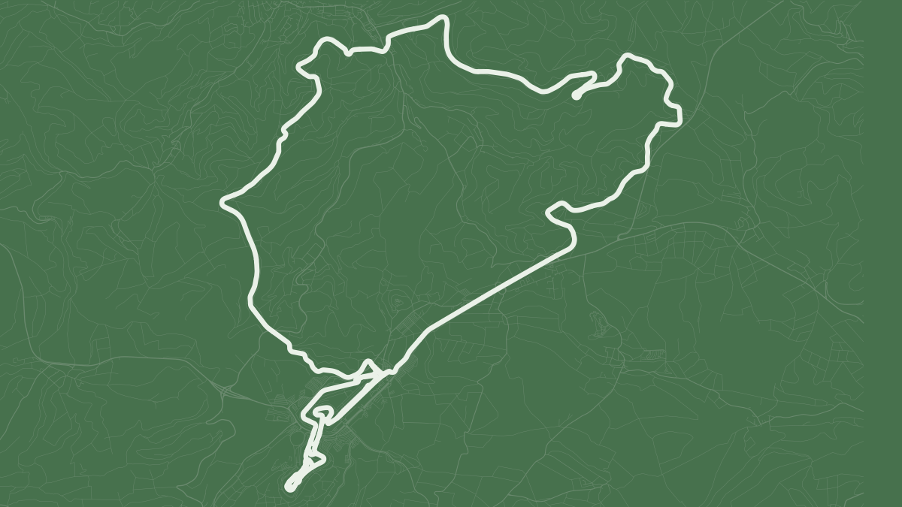

<script>document.body.style.setProperty("--blog-background", "#47714D")</script>

```{r}
#| label: setup
#| include: false

# Locate the project root when running chunks interactively or rendering the post.
here::i_am("blog/posts/2026-09-08-nurburgring-one-geom-at-a-time/index.qmd")
source(here::here("blog", "_R", "post_setup.R"))

# Apply the editorial green to the shared defaults and retain it for local layers.
forest_green <- set_plot_accent_color("#47714D")
install_missing_packages(c("here", "dplyr", "ggforce", "ggplot2", "sf", "osmdata", "tibble", "svglite", "knitr"))

# Keep data and images beside the post, regardless of the working directory.
post_dir <- here::here("blog", "posts", "2026-09-08-nurburgring-one-geom-at-a-time")
```

OpenStreetMap gives us enough detail to draw the Nürburgring without a basemap.
In this post I build the map progressively: first the surrounding road network,
then line-width hierarchy, waterways and the racetrack itself, finishing with a
few named Nordschleife sections and the Sprintstrecke.

The palette follows the place rather than a generic map style. Forest green nods
to the Nordschleife's
[**Green Hell**](https://nuerburgring.de/info/nuerburgring/race-tracks/nordschleife){style="color: #47714D;"}
nickname, while cool asphalt greys keep the surrounding roads quiet.

{fig-alt="A stylised map of Nürburgring with the racetrack highlighted against the surrounding road network."}

## Map area

Set the screen resolution and map width here. Height follows the screen ratio.
Reduce `width_km` to zoom in; `extra_area_pct` adds space around the shared map view.
The download uses the coordinates below; the visible maps are centred on the
racetrack bounds, with optional east/north shifts for fine-tuning.

```{r}
#| label: map-area

# 1440p in landscape orientation.
screen_width_px <- 2560
screen_height_px <- 1440
# Sets text and stroke scale at the requested pixel dimensions.
export_dpi <- 160

# Download centre: longitude in decimal degrees, east of Greenwich.
centre_lon <- 6.95
# Download centre: latitude in decimal degrees, north of the equator.
centre_lat <- 50.35
# Lower this to show less space around the circuit.
width_km <- 14
# Extra area around the shared map view.
extra_area_pct <- 15
# Trim the visible frame without changing the cached download area.
visible_crop_pct <- 14
# Optional offset from the racetrack centre: positive east moves the track left.
map_shift_east_km <- 0
# Positive north moves the track down; zero keeps it vertically centred.
map_shift_north_km <- 0

stopifnot(screen_width_px > 0, screen_height_px > 0, export_dpi > 0,
          width_km > 0, extra_area_pct >= 0,
          visible_crop_pct >= 0, visible_crop_pct < 100)

# Match the geographic frame to the screen without stretching the roads.
screen_ratio <- screen_width_px / screen_height_px
height_km <- width_km / screen_ratio

# Keep the same proportions for the maps in the post and the wallpaper exports.
knitr::opts_chunk$set(fig.asp = 1 / screen_ratio)

# Show the projected frame areas before making any download request.
c(detail_km2 = width_km * height_km,
  surroundings_km2 = width_km * height_km * (1 + extra_area_pct / 100))
```

Build the download frame in metres using the local UTM projection.

```{r}
#| label: define-map-frames

# EPSG:4326 identifies longitude/latitude coordinates in WGS84.
centre <- sf::st_sfc(sf::st_point(c(centre_lon, centre_lat)), crs = 4326) |>
  # ETRS89 / UTM zone 32N uses metres in this region.
  sf::st_transform(25832) |>
  # Extract the projected x and y coordinates.
  sf::st_coordinates()

# Use a plain vector for the frame calculations.
centre <- as.numeric(centre)

make_frame <- function(width_m, height_m, frame_centre = centre) {
  # Half the width and height on each side keep the rectangle centred.
  sf::st_bbox(c(
    xmin = frame_centre[1] - width_m / 2,
    ymin = frame_centre[2] - height_m / 2,
    xmax = frame_centre[1] + width_m / 2,
    ymax = frame_centre[2] + height_m / 2
  ), crs = sf::st_crs(25832)) |>
    # Turn the bounds into a polygon for clipping and plotting.
    sf::st_as_sfc()
}

# Convert kilometres to the projection's metre units.
width_m <- width_km * 1000
height_m <- height_km * 1000

# Area = width × height: scale both sides by the square root of the area multiplier.
margin_scale <- sqrt(1 + extra_area_pct / 100)

download_frame <- make_frame(
  width_m * margin_scale,
  height_m * margin_scale
)

```

## Data

Download once per area and save an RDS. The same settings reuse the file;
changing them creates a separate cache.

```{r}
#| label: load-openstreetmap-data

# Include every area setting so a different frame cannot reuse the wrong data.
area_id <- paste(centre_lon, centre_lat, width_km, height_km, extra_area_pct, sep = "_")

osm_file <- file.path(post_dir, "data", paste0("osm-", area_id, ".rds"))

if (!file.exists(osm_file)) {
  # Overpass needs longitude/latitude bounds; their envelope is slightly larger.
  bbox_wgs84 <- download_frame |> sf::st_transform(4326) |> sf::st_bbox()
  # Ways contain the road and river geometry; timeout is a server time limit in seconds.
  query <- osmdata::opq(bbox = bbox_wgs84, osm_types = "way", timeout = 180) |>
    # The plural function combines filters with OR: highways OR rivers/streams.
    # Match these waterway values exactly.
    osmdata::add_osm_features(features = c(
      '"highway"', '"waterway"~"^(river|stream)$"'
    ))

  message("Downloading and converting roads and rivers...")
  # Convert the response to sf objects and show progress messages.
  osm <- osmdata::osmdata_sf(query, quiet = FALSE)

  # Keep only the line layer used below.
  osm <- list(osm_lines = osm$osm_lines)

  message("Saving data...")
  dir.create(dirname(osm_file), recursive = TRUE, showWarnings = FALSE)
  saveRDS(osm, osm_file)
}

osm <- readRDS(osm_file)

# Tighten the visible frame without changing the cached download area.
visible_scale <- 1 - visible_crop_pct / 100
visible_width_m <- width_m * visible_scale
visible_height_m <- height_m * visible_scale
```

The query uses [`osmdata`](https://docs.ropensci.org/osmdata/articles/osmdata.html).
Separate the roads and waterways into layers.

```{r}
#| label: prepare-map-layers
#| message: false

library(dplyr)

roads <- osm$osm_lines |>
  # The highway tag includes paths and racetracks.
  filter(!is.na(highway)) |>
  # Keep useful tags; sf retains the geometry.
  select(osm_id, name, highway) |>
  sf::st_transform(25832)

waterways <- osm$osm_lines |>
  filter(waterway %in% c("river", "stream")) |>
  sf::st_transform(25832)

# Measure the racetracks before clipping so the crop cannot bias their centre.
circuit_bbox <- roads |>
  filter(highway == "raceway") |>
  sf::st_bbox()

if (!all(is.finite(circuit_bbox))) {
  stop("No racetrack geometry found in the downloaded area.")
}

# Midpoints of the bounds give equal space on opposite sides of the racetracks.
circuit_centre <- c(
  (circuit_bbox[["xmin"]] + circuit_bbox[["xmax"]]) / 2,
  (circuit_bbox[["ymin"]] + circuit_bbox[["ymax"]]) / 2
)

# Convert the optional offsets from kilometres to metres.
map_centre <- circuit_centre + c(map_shift_east_km, map_shift_north_km) * 1000

map_frame <- make_frame(
  visible_width_m * margin_scale,
  visible_height_m * margin_scale,
  map_centre
)

# Reuse these bounds across every map in the post.
map_bbox <- sf::st_bbox(map_frame)

# Clip lines to the frame itself: Overpass may return ways that extend outside it.
roads_surroundings <- sf::st_intersection(roads, map_frame)
water_map <- sf::st_crop(waterways, map_bbox)
```

A quick look at the selected road fields keeps the following steps grounded in
the data actually returned by OpenStreetMap.

```{r}
#| label: inspect-road-data

roads |>
  sf::st_drop_geometry() |>
  glimpse()
```

## One line weight

Start with every road drawn alike. Apply `coord_sf()` after the spatial layers
to keep the explicit limits and `expand = FALSE`, avoiding an empty border
around the clipped roads. A small credit sits inside the map; no scale bar,
caption strip or outer margin is added to the wallpaper.

```{r}
#| label: draw-uniform-roads
#| message: false
#| column: page
#| fig-cap: "Every road uses the same colour and line width."
#| fig-alt: "The road network around Nürburgring, drawn in thin grey lines on a light grey background."

library(ggplot2)

# Cool greys separate the asphalt background from the circuit's forest green.
asphalt_light <- "#E3E8EB"
# A blue-charcoal version keeps the same cool family on the dark map.
asphalt_dark <- "#30373D"

# Reuse the blog's shared typography.
map_font <- theme_get()$text$family

# Matching panel and canvas backgrounds keep the wallpaper filled to its edges.
map_theme <- theme_void(base_family = map_font) +
  theme(
    panel.background = element_rect(fill = asphalt_light, colour = NA),
    plot.background = element_rect(fill = asphalt_light, colour = NA),
    plot.margin = margin(0, 0, 0, 0)
  )

# Put the credit inside either frame, without a text box or an external caption.
map_credit <- function(bounds = map_bbox, colour = "#62717A") {
  annotate(
    "text",
    # Inset the text 1.2% from the left and bottom edges of the projected frame.
    x = bounds[["xmin"]] + 0.012 * (bounds[["xmax"]] - bounds[["xmin"]]),
    y = bounds[["ymin"]] + 0.012 * (bounds[["ymax"]] - bounds[["ymin"]]),
    label = "© OpenStreetMap contributors",
    family = map_font,
    size = 1.4,
    colour = colour,
    hjust = 0,
    vjust = 0
  )
}

# Fixed limits let us compare styles without changing the close view.
map_coords <- coord_sf(
  crs = 25832,
  xlim = map_bbox[c("xmin", "xmax")],
  ylim = map_bbox[c("ymin", "ymax")],
  # Add no coordinate padding or latitude/longitude graticule.
  expand = FALSE,
  datum = NA
)

# Keep the canvas free of captions; add the credit after the road layers.
detail_canvas <- ggplot() +
  map_theme

uniform_map <- detail_canvas +
  geom_sf(
    data = roads_surroundings,
    colour = "#77858E",
    linewidth = 0.15
  ) +
  map_credit() +
  map_coords

uniform_map
```

## Line widths

Use `highway` to set a visual hierarchy, including
[`raceway` for racetracks](https://wiki.openstreetmap.org/wiki/Tag:highway%3Draceway).
The widths are design choices, rather than physical road measurements.
Before defining broader visual groups, inspect which `highway` tags are present
inside the shared map frame. Because the geometries use EPSG:25832, their lengths
can also be summed directly in kilometres.

```{r}
#| label: inspect-highway-tags

roads_surroundings |>
  mutate(length_km = as.numeric(sf::st_length(geometry)) / 1000) |>
  sf::st_drop_geometry() |>
  summarise(
    ways = n_distinct(osm_id),
    length_km = round(sum(length_km), 1),
    .by = highway
  ) |>
  arrange(desc(length_km))
```

For comparison, the [official Nürburgring record definitions](https://www.nuerburgring.de/info/nuerburgring/records?locale=en)
list the Nordschleife at 20.832 km and the Grand Prix Track at 5.148 km. The OSM
`raceway` total is a geometry check over all raceway-tagged ways in the frame,
not an official circuit length.

The `name` tag shows how that total is split across the raceway ways. Missing
names stay visible as `Unnamed` rather than being dropped. The full list is kept
collapsed because OSM names many individual track sections, not just whole circuits.

```{r}
#| label: inspect-raceway-names
#| results: asis
#| code-fold: true
#| code-summary: "Code"

raceways <- roads_surroundings |>
  filter(highway == "raceway") |>
  mutate(
    raceway_name = coalesce(name, "Unnamed"),
    length_km = as.numeric(sf::st_length(geometry)) / 1000
  )

raceway_summary <- raceways |>
  sf::st_drop_geometry() |>
  summarise(
    ways = n_distinct(osm_id),
    length_km = round(sum(length_km), 2),
    .by = raceway_name
  ) |>
  arrange(desc(length_km))

cat("<details>\n")
cat("<summary>Show all ", nrow(raceway_summary), " raceway names</summary>\n\n", sep = "")
cat('<div style="max-height: 22rem; overflow-y: auto;">\n')
cat(knitr::kable(raceway_summary, format = "html"))
cat("\n</div>\n\n</details>\n")
```

Keep every road group, but give minor paths thinner, quieter lines and the
circuit a stronger stroke.

```{r}
#| label: classify-road-hierarchy

# Combine related OSM tags so each road group can share one style.
roads_surroundings <- roads_surroundings |>
  mutate(road_group = case_match(
    highway,
    "raceway" ~ "Racetracks",
    c("motorway", "motorway_link") ~ "Motorways",
    c("trunk", "trunk_link", "primary", "primary_link") ~
      "Main roads",
    c("secondary", "secondary_link", "tertiary", "tertiary_link") ~
      "Regional roads",
    c("residential", "living_street", "unclassified") ~
      "Local roads",
    "service" ~ "Service roads",
    "track" ~ "Farm and forest tracks",
    c("path", "footway", "cycleway", "bridleway", "steps", "pedestrian") ~
      "Non-motorised paths",
    .default = "Other"
  ))

# The table order also sets the drawing order, from quietest to strongest.
road_style <- tibble::tribble(
  ~road_group,                ~line_width, ~line_colour, ~dark_colour,
  "Other",                         0.06, "#D3DADE",    "#3C4449",
  "Non-motorised paths",           0.06, "#CCD5DA",    "#404A50",
  "Farm and forest tracks",        0.08, "#C0CBD1",    "#48545B",
  "Service roads",                 0.10, "#B6C2C9",    "#515F67",
  "Local roads",                   0.14, "#A4B2BA",    "#60717A",
  "Regional roads",                0.23, "#8B9DA7",    "#788E9A",
  "Main roads",                    0.30, "#738A96",    "#90A6B1",
  "Motorways",                     0.38, "#58727E",    "#A6BAC4",
  "Racetracks",                    1.10, forest_green,  "#E0EFD9"
)

roads_surroundings <- roads_surroundings |>
  # Attach widths and colours to each road.
  left_join(road_style, by = "road_group") |>
  # Preserve the table order when drawing the layers.
  mutate(road_group = factor(road_group, levels = road_style$road_group)) |>
  arrange(road_group)

```

Keep the colour constant to see what line width changes.

```{r}
#| label: draw-road-width-hierarchy
#| column: page
#| fig-cap: "Line width separates the main roads from minor paths."
#| fig-alt: "The same grey road network, with thicker strokes for racetracks and major roads."

width_map <- detail_canvas +
  geom_sf(
    data = roads_surroundings,
    aes(linewidth = line_width),
    colour = "#77858E",
    lineend = "round"
  ) +
  # Use the table's widths directly, without rescaling.
  scale_linewidth_identity() +
  map_credit() +
  map_coords

width_map
```

## Surroundings and the circuit

Add colour and rivers first, keeping the racetrack out of the surrounding road
layer. Faint blue-grey lines are minor roads and paths, including forest tracks;
pale blue lines are waterways.

```{r}
#| label: draw-surroundings-map
#| column: page
#| fig-cap: "The surrounding road network before the racetrack is added."
#| fig-alt: "A map of the roads around Nürburgring, with blue-grey road hierarchy and pale waterways but no highlighted racetrack."

water_colour <- "#B7C9D1"

roads_context <- roads_surroundings |>
  filter(road_group != "Racetracks")

surroundings_map <- detail_canvas +
  # Water goes below roads so the road hierarchy stays legible at crossings.
  geom_sf(
    data = water_map,
    colour = water_colour,
    linewidth = 0.10
  ) +
  geom_sf(
    data = roads_context,
    aes(colour = line_colour, linewidth = line_width),
    lineend = "round"
  ) +
  scale_colour_identity() +
  scale_linewidth_identity() +
  map_credit() +
  map_coords

surroundings_map
```

With the context in place, the Nürburgring is one more geometry: add the ways
tagged as `raceway` on top of the same map.

```{r}
#| label: add-raceway-geom
#| column: page
#| fig-cap: "The racetrack added as one final geometry over the surrounding roads."
#| fig-alt: "Nürburgring in forest green, highlighted over a blue-grey surrounding road network on a pale asphalt background."

detail_map <- surroundings_map +
  geom_sf(
    data = raceways,
    colour = forest_green,
    linewidth = 1.10,
    lineend = "round",
    inherit.aes = FALSE
  )

detail_map
```

## A darker version

The light version uses a cool asphalt grey. Blue-charcoal and lighter roads give
the same map a darker treatment. The preview uses muted forest green (`#47714D`).

```{r}
#| label: draw-dark-circuit-map
#| column: page
#| code-fold: true
#| code-summary: "Code"
#| fig-cap: "The same roads and frame, with colours adjusted for a charcoal background."
#| fig-alt: "Nürburgring in pale green against blue-charcoal, with muted blue-grey roads and streams."

# Reuse the exact frame and geometries; only the palette changes.
dark_map <- detail_canvas +
  geom_sf(
    data = water_map,
    colour = "#43545E",
    linewidth = 0.10
  ) +
  geom_sf(
    data = roads_surroundings,
    aes(colour = dark_colour, linewidth = line_width),
    lineend = "round"
  ) +
  scale_colour_identity() +
  scale_linewidth_identity() +
  # Match both backgrounds and lighten the overlaid credit for this palette.
  theme(
    panel.background = element_rect(fill = asphalt_dark, colour = NA),
    plot.background = element_rect(fill = asphalt_dark, colour = NA)
  ) +
  map_credit(colour = "#A6B6C0") +
  map_coords

dark_map
```

## Circuit details

OpenStreetMap stores the Nordschleife as individually named raceway ways. Rather
than marking each section as a point, keep the actual line geometry and let
`ggforce::geom_mark_hull()` anchor each annotation to the full highlighted section.
For this annotated view, remove the surrounding roads and waterways so the raceway
geometry stays in focus. The short annotations below paraphrase the
[official Nürburgring Nordschleife guide](https://mobile.nuerburgring.de/info/nuerburgring/race-tracks/nordschleife?locale=en).

```{r}
#| label: draw-featured-raceway-sections
#| column: page
#| fig-cap: "Five Nordschleife sections highlighted and annotated from their complete track geometry."
#| fig-alt: "The Nürburgring raceway on a dark green background, with five famous Nordschleife sections highlighted and annotated."

section_names <- c(
  "Fuchsröhre",
  "Flugplatz",
  "Döttinger Höhe",
  "Karussell",
  "Brünnchen"
)

featured_raceways <- raceways |>
  filter(raceway_name %in% section_names)

section_descriptions <- tibble::tribble(
  ~section,           ~description,
  "Fuchsröhre",       "Named after a fox in a construction pipe.",
  "Flugplatz",        "Named after the former glider airfield.",
  "Döttinger Höhe",   "Named after nearby Döttingen.",
  "Karussell",        "Famous banked turn linked to Caracciola.",
  "Brünnchen",        "The YouTube corner, famous for Touristenfahrten fails."
)

track_sections <- featured_raceways |>
  mutate(section = raceway_name) |>
  group_by(section) |>
  summarise() |>
  mutate(section_label = if_else(section == "Karussell", "Caracciola-Karussell", section)) |>
  left_join(section_descriptions, by = "section") |>
  mutate(label = section_label)

# Densify the same section lines so the annotation stays tied to the full segment.
section_hull_points <- track_sections |>
  sf::st_segmentize(dfMaxLength = 25) |>
  sf::st_cast("POINT", warn = FALSE)

section_xy <- sf::st_coordinates(section_hull_points)
section_hull_points <- section_hull_points |>
  mutate(
    x = section_xy[, 1],
    y = section_xy[, 2]
  )

# Fix annotation anchors around the outside of the track instead of letting them float.
section_label_positions <- tibble::tribble(
  ~section,           ~x_frac, ~y_frac,
  "Fuchsröhre",          0.14,    0.72,
  "Flugplatz",           0.20,    0.28,
  "Döttinger Höhe",      0.60,    0.27,
  "Karussell",           0.68,    0.86,
  "Brünnchen",           0.80,    0.64
) |>
  mutate(
    x0 = map_bbox[["xmin"]] + x_frac * (map_bbox[["xmax"]] - map_bbox[["xmin"]]),
    y0 = map_bbox[["ymin"]] + y_frac * (map_bbox[["ymax"]] - map_bbox[["ymin"]])
  ) |>
  select(section, x0, y0)

section_hull_points <- section_hull_points |>
  left_join(section_label_positions, by = "section")

sections_background <- "#29452F"
sections_track <- "#788993"
sections_highlight <- "#E6D6A8"
sections_annotation <- "#C7D4CA"

p_sections <- ggplot() +
  geom_sf(
    data = raceways,
    colour = sections_track,
    linewidth = 0.70,
    lineend = "round"
  ) +
  # Keep the same line weight and distinguish selected sections only by colour.
  geom_sf(
    data = track_sections,
    colour = sections_highlight,
    linewidth = 0.70,
    lineend = "round",
    inherit.aes = FALSE
  ) +
  ggforce::geom_mark_hull(
    data = section_hull_points,
    aes(
      x = x,
      y = y,
      x0 = x0,
      y0 = y0,
      group = section,
      label = label,
      description = description
    ),
    # Hide the hull itself; retain only its annotation connector and label.
    colour = NA,
    fill = NA,
    size = 0,
    concavity = 2,
    expand = grid::unit(1.5, "mm"),
    radius = grid::unit(1, "mm"),
    label.minwidth = grid::unit(28, "mm"),
    label.buffer = grid::unit(1.5, "mm"),
    # Let a little of the map background show through the annotation box.
    label.fill = grDevices::adjustcolor(sections_background, alpha.f = 0.82),
    label.colour = "#F1F5F2",
    label.fontsize = c(7, 6),
    label.family = map_font,
    con.colour = sections_annotation,
    con.size = 0.25,
    con.type = "elbow",
    inherit.aes = FALSE
  ) +
  annotate(
    "text",
    x = map_bbox[["xmin"]] + 0.025 * (map_bbox[["xmax"]] - map_bbox[["xmin"]]),
    y = map_bbox[["ymax"]] - 0.035 * (map_bbox[["ymax"]] - map_bbox[["ymin"]]),
    label = "NORDSCHLEIFE · 20.832 km",
    family = map_font,
    fontface = "bold",
    size = 3.9,
    colour = "#F1F5F2",
    hjust = 0,
    vjust = 1
  ) +
  theme_void(base_family = map_font) +
  theme(
    panel.background = element_rect(fill = sections_background, colour = NA),
    plot.background = element_rect(fill = sections_background, colour = NA),
    plot.margin = margin(0, 0, 0, 0)
  ) +
  map_credit(colour = "#D3E0D1") +
  map_coords

p_sections
```

### Sprintstrecke

The name summary also reveals a compact layout stored across nine ways as
`Nürburgring Sprintstrecke`. Keep only the nearby road network for context, with
its line widths subdued so the Sprintstrecke remains the focus.

```{r}
#| label: draw-sprintstrecke
#| column: page
#| fig-cap: "Nürburgring Sprintstrecke highlighted within the nearby road network."
#| fig-alt: "The Nürburgring Sprintstrecke in forest green, surrounded by a subdued local road network."

sprintstrecke <- raceways |>
  filter(raceway_name == "Nürburgring Sprintstrecke")

stopifnot(nrow(sprintstrecke) > 0)

sprint_bbox_raw <- sf::st_bbox(sprintstrecke)
sprint_centre <- c(
  (sprint_bbox_raw[["xmin"]] + sprint_bbox_raw[["xmax"]]) / 2,
  (sprint_bbox_raw[["ymin"]] + sprint_bbox_raw[["ymax"]]) / 2
)

# A slightly tighter frame makes the Sprintstrecke larger; shift south to move it up.
sprint_centre <- sprint_centre + c(0, -150)
sprint_frame <- make_frame(4500, 4500 / screen_ratio, sprint_centre)
sprint_bbox <- sf::st_bbox(sprint_frame)

sprint_roads <- sf::st_intersection(roads_surroundings, sprint_frame) |>
  mutate(sprint_width = line_width * 0.35)

sprint_map <- ggplot() +
  geom_sf(
    data = sprint_roads,
    aes(colour = line_colour, linewidth = sprint_width),
    lineend = "round"
  ) +
  geom_sf(
    data = sprintstrecke,
    colour = forest_green,
    linewidth = 1.35,
    lineend = "round",
    inherit.aes = FALSE
  ) +
  scale_colour_identity() +
  scale_linewidth_identity() +
  map_credit(bounds = sprint_bbox) +
  map_theme +
  coord_sf(
    crs = 25832,
    xlim = sprint_bbox[c("xmin", "xmax")],
    ylim = sprint_bbox[c("ymin", "ymax")],
    expand = FALSE,
    datum = NA
  )

sprint_map
```

## Export plots

Save the maps built through the post as PNG and SVG. The PNGs use the exact
screen dimensions through [`ggsave()`](https://ggplot2.tidyverse.org/reference/ggsave.html);
SVG stays scalable.

```{r}
#| label: export-plots

images_dir <- file.path(post_dir, "images")
dir.create(images_dir, recursive = TRUE, showWarnings = FALSE)

# Pixel dimensions fix the PNG size; dpi controls the physical scale used for styling.
save_map <- function(map, name) {
  ggsave(
    filename = file.path(images_dir, paste0(name, ".png")),
    plot = map,
    width = screen_width_px,
    height = screen_height_px,
    units = "px",
    dpi = export_dpi,
    # Use the map's own background for an opaque, edge-to-edge export.
    bg = NULL
  )

  ggsave(
    filename = file.path(images_dir, paste0(name, ".svg")),
    plot = map,
    width = screen_width_px,
    height = screen_height_px,
    units = "px",
    dpi = export_dpi,
    bg = NULL
  )
}

save_map(uniform_map, "roads-uniform")
save_map(width_map, "roads-hierarchy")
save_map(surroundings_map, "roads-surroundings")
save_map(detail_map, "roads-light")
save_map(dark_map, "roads-dark")
save_map(p_sections, "circuit-sections")
save_map(sprint_map, "sprintstrecke")
```

```{r}
#| label: generate-roads-preview
#| include: false

# Reuse the same centre with a tighter frame, without measuring clipped roads again.
preview_bbox <- make_frame(
  visible_width_m,
  visible_height_m,
  map_centre
) |>
  sf::st_bbox()

# Keep nearby roads visible while giving the pale circuit the strongest stroke.
preview_roads <- roads_surroundings |>
  mutate(
    preview_colour = if_else(road_group == "Racetracks", "#EAF1E8", "#718894"),
    preview_width = if_else(road_group == "Racetracks", line_width * 1.35, pmax(line_width, 0.10))
  )

preview_map <- ggplot(preview_roads) +
  geom_sf(aes(colour = preview_colour, linewidth = preview_width), lineend = "round") +
  scale_colour_identity() +
  scale_linewidth_identity() +
  map_credit(bounds = preview_bbox, colour = "#D3E0D1") +
  coord_sf(
    crs = 25832,
    xlim = preview_bbox[c("xmin", "xmax")],
    ylim = preview_bbox[c("ymin", "ymax")],
    expand = FALSE,
    datum = NA
  ) +
  map_theme +
  theme(
    panel.background = element_rect(fill = forest_green, colour = NA),
    plot.background = element_rect(fill = forest_green, colour = NA),
    plot.margin = margin(0, 0, 0, 0)
  )

ggsave(file.path(post_dir, "images", "preview.png"), preview_map, width = 8, height = 8 / screen_ratio, units = "in", dpi = 150, bg = forest_green)
```

Data: [© OpenStreetMap contributors](https://www.openstreetmap.org/copyright),
licensed under the ODbL.

Circuit and section reference: [official Nürburgring Nordschleife guide](https://nuerburgring.de/info/nuerburgring/race-tracks/nordschleife).

Reference: [Bastián Olea's tutorial](https://bastianolea.rbind.io/blog/tutorial_mapas_osm/)
and its [source code](https://github.com/bastianolea/tutorial_r_mapa_openstreetmap/blob/main/tutorial_mapas_osm.qmd).